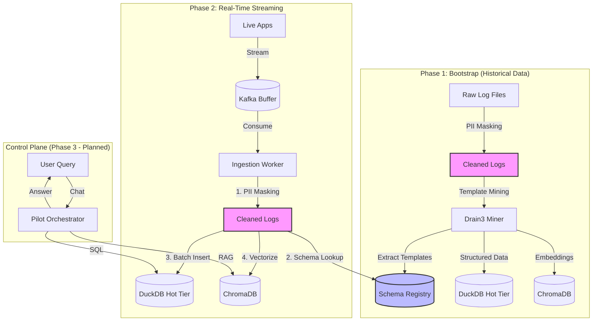

# GenAI LogPilot 🚁

> **An intelligent log management system powered by LLMs for natural language querying, anomaly detection, and automated root cause analysis.**

[](https://opensource.org/licenses/MIT)
[](https://www.python.org/downloads/)

---

## 🎯 What is LogPilot?

LogPilot is an **enterprise-grade log management platform** that goes beyond traditional grep/Splunk by using **Large Language Models (LLMs)** to understand log semantics, group errors intelligently, and provide actionable insights through natural language queries.

### Key Differentiators
- **Natural Language Querying**: Ask "Why did User 123 fail?" instead of writing complex regex
- **Template Mining**: Automatically extracts patterns from millions of logs (Drain3-based)
- **PII Masking**: Built-in privacy protection for sensitive data (emails, SSNs, credit cards)
- **Hybrid Storage**: DuckDB for structured queries + ChromaDB for semantic search
- **Enterprise-Ready**: RBAC, encryption, audit trails, tiered storage

---

## 🏗️ Architecture Overview

LogPilot follows a **Data Lakehouse + RAG** architecture with two distinct operational phases:



### Data Flow & Processing Steps

| Step | Component | Function | Status |
|------|-----------|----------|--------|
| 1️⃣ | **PII Masker** | Redacts emails, IPs, credit cards, SSNs using regex | ✅ Implemented |
| 2️⃣ | **Template Miner** | Extracts log patterns (e.g., "User `<*>` failed login") | ✅ Implemented (Mock) |
| 3️⃣ | **Schema Registry** | Caches templates to avoid re-processing | ✅ Implemented (Mock) |
| 4️⃣ | **Batch Processor** | Buffers logs and bulk-inserts to DuckDB | ✅ Implemented |
| 5️⃣ | **Vector Embedder** | Converts logs to embeddings for semantic search | 🔜 Planned |
| 6️⃣ | **LLM Orchestrator** | Routes queries to SQL or RAG tools | 🔜 Planned |

---

## 📁 Project Structure

```
log-pilot/
├── data/
│   ├── landing_zone/       # Raw historical logs (for Phase 1)
│   └── logs.duckdb         # DuckDB database (generated)
├── docs/
│   ├── architecture.md     # High-level design & enterprise features
│   ├── system_components.md # Service breakdown & process flow
│   └── refined_requirements.md
├── services/
│   ├── bulk-loader/        # Phase 1: Historical data ingestion
│   │   └── src/log_loader.py
│   ├── ingestion-worker/   # Phase 2: Real-time log streaming
│   │   └── src/main.py
│   ├── pilot-orchestrator/ # Phase 3: LLM agent (planned)
│   ├── tool-service/       # Phase 3: SQL & RAG tools (planned)
│   └── schema-registry/    # Shared template cache
├── shared/
│   ├── log_schema.py       # Golden Standard Log Event model
│   ├── db_connectors.py    # DuckDB connector with batch insert
│   └── utils.py            # PII masking utilities
└── README_CONTEXT.md       # Master design context doc
```

---

## 🚀 Quick Start

### Prerequisites

- **Python**: 3.9 or higher
- **pip**: Package installer for Python
- **Git**: Version control

### 1. Clone the Repository

```bash
git clone https://github.com/yourusername/log-pilot.git
cd log-pilot
```

### 2. Install Dependencies

```bash
# For Ingestion Worker (Phase 2)
pip3 install -r services/ingestion-worker/requirements.txt

# For Bulk Loader (Phase 1) - if you want to run historical ingestion
# pip3 install -r services/bulk-loader/requirements.txt
```

### 3. Prepare Sample Data (Optional - for Phase 1)

If you want to test historical data ingestion:

```bash
# Create landing zone directory
mkdir -p data/landing_zone

# Add sample log files
cat > data/landing_zone/sample.log << EOF
2025-11-20 10:00:01 INFO payment-service: Payment processed for user_id=101 amount=50.00
2025-11-20 10:00:02 ERROR auth-service: Login failed for user=admin ip=192.168.1.5
2025-11-20 10:00:03 WARN db-service: Slow query detected on table=users duration=500ms
EOF
```

---

## 🧪 Running the System

### Phase 1: Bulk Loader (Historical Data)

Ingest historical logs from files:

```bash
cd services/bulk-loader
python3 src/log_loader.py
```

**What it does:**
- Reads logs from `data/landing_zone/`
- Applies PII masking
- Mines templates using Drain3
- Bulk loads into `data/logs.duckdb`

**Expected Output:**
```
🚀 Starting Bulk Loader...
📂 Found 1 files in landing_zone
✅ Processed 3 logs
💾 Flushing batch of 3 logs to DuckDB...
✅ Successfully ingested 3 logs
```

### Phase 2: Ingestion Worker (Real-Time)

Process streaming logs (currently uses mock Kafka):

```bash
cd services/ingestion-worker
python3 src/main.py
```

**What it does:**
- Simulates Kafka stream with mock logs
- Applies **PII masking** before processing
- Looks up templates from Schema Registry
- Batch-inserts into DuckDB

**Expected Output:**
```
🚀 Starting Ingestion Worker (Real-Time Mode)...
🔒 PII Masking Enabled
🗄️  DuckDB Persistence Enabled

✅ Processed: 2025-11-20 10:00:06 [email-service] Sending email to <EMAIL_REDACTED>
✅ Processed: 2025-11-20 10:00:07 [billing-service] Charging card <CC_REDACTED> for $99.99
💾 Flushing batch of 2 logs to DuckDB...

🔎 Verifying Data in DuckDB:
   Total Rows: 7
   Sample Rows (Check PII Masking):
   - Body: Charging card <CC_REDACTED> for $99.99
   - Context: {}
```

---

## 🔬 Testing & Verification

### 1. Check Database Contents

```bash
# Install DuckDB CLI (optional)
brew install duckdb  # macOS
# or: pip3 install duckdb

# Query the database
duckdb data/logs.duckdb
```

**Sample Queries:**
```sql
-- View all logs
SELECT timestamp, severity, service_name, body FROM logs ORDER BY timestamp DESC LIMIT 10;

-- Check PII masking effectiveness
SELECT body, context FROM logs WHERE body LIKE '%REDACTED%';

-- Count logs by service
SELECT service_name, COUNT(*) as log_count FROM logs GROUP BY service_name;

-- Search for specific user errors (using JSON context)
SELECT * FROM logs WHERE context->>'user_id' = '101' AND severity = 'ERROR';
```

### 2. Verify PII Masking

The `shared/utils.py` module masks:
- **Emails**: `john.doe@example.com` → `<EMAIL_REDACTED>`
- **IPs**: `192.168.1.5` → `<IP_REDACTED>`
- **Credit Cards**: `4111-1111-1111-1111` → `<CC_REDACTED>`
- **SSNs**: `123-45-6789` → `<SSN_REDACTED>`

Run the ingestion worker and verify output contains `<*_REDACTED>` placeholders.

### 3. Unit Tests (Future)

```bash
# Run tests when implemented
pytest services/ingestion-worker/tests/
pytest shared/tests/
```

---

## 📊 Current Implementation Status

| Component | Status | Description |
|-----------|--------|-------------|
| **Bulk Loader** | ✅ Complete | Historical data ingestion with template mining |
| **Ingestion Worker** | ✅ Complete | Real-time streaming with PII masking & batching |
| **PII Masker** | ✅ Complete | Regex-based redaction for sensitive data |
| **DuckDB Connector** | ✅ Complete | Batch insert with JSON context support |
| **Schema Registry** | 🔄 Mock | In-memory template cache (needs Redis/API) |
| **Kafka Integration** | 🔄 Mock | Using synthetic logs (needs real broker) |
| **Vector DB (ChromaDB)** | 🔜 Planned | For semantic search |
| **Pilot Orchestrator** | 🔜 Planned | LLM-powered query router |
| **API Gateway** | 🔜 Planned | Authentication & RBAC |

---

## 🔐 Security & Compliance

### Implemented Features
- ✅ **PII Masking**: Automatic redaction during ingestion
- ✅ **Structured Logging**: Golden Standard schema prevents data leaks
- ✅ **Context Isolation**: Sensitive fields stored in queryable JSON

### Planned Features (Phase 3+)
- 🔜 **RBAC**: Admin, Analyst, Viewer roles
- 🔜 **Encryption**: AES-256 at rest, TLS 1.3 in transit
- 🔜 **Audit Trails**: All user queries logged
- 🔜 **Right to be Forgotten**: User ID-based purge jobs

---

## 🛣️ Roadmap

### ✅ Phase 1: Data Plane (Complete)
- Bulk historical data ingestion
- Template mining with Drain3
- DuckDB persistence layer

### ✅ Phase 2: Streaming Ingestion (Complete)
- Real-time Kafka consumption
- PII masking pipeline
- Batch processing optimization

### 🔜 Phase 3: Control Plane (In Progress)
- LLM orchestrator (LangChain)
- Text-to-SQL generator
- RAG retriever for semantic search
- Chat interface

### 🔮 Future Phases
- **Predictive Analytics**: Anomaly detection with ML models
- **Workflow Integrations**: Jira/ServiceNow ticket creation
- **Tiered Storage**: Hot/Warm/Cold data lifecycle management

---

## 📚 Documentation

- **[Architecture Design](docs/architecture.md)**: High-level system design, enterprise features, and data flow
- **[System Components](docs/system_components.md)**: Service breakdown, process flow, and developer guide
- **[Master Context](README_CONTEXT.md)**: Core decisions, requirements, and implementation strategy

---

## 🤝 Contributing

Contributions are welcome! Please read our [Contributing Guidelines](CONTRIBUTING.md) first.

### Development Setup
1. Fork the repository
2. Create a feature branch: `git checkout -b feature/amazing-feature`
3. Make your changes
4. Run tests: `pytest`
5. Commit: `git commit -m 'Add amazing feature'`
6. Push: `git push origin feature/amazing-feature`
7. Open a Pull Request

---

## 📄 License

This project is licensed under the MIT License - see the [LICENSE](LICENSE) file for details.

---

## 🙏 Acknowledgments

- **Drain3**: For log template mining algorithm
- **DuckDB**: For high-performance analytical queries
- **ChromaDB**: For vector storage (planned integration)
- **LangChain**: For LLM orchestration (planned integration)

---

## 📞 Contact & Support

- **Issues**: [GitHub Issues](https://github.com/yourusername/log-pilot/issues)
- **Discussions**: [GitHub Discussions](https://github.com/yourusername/log-pilot/discussions)
- **Email**: support@logpilot.dev

---

**Built with ❤️ for DevOps, SRE, and Security teams who deserve better log analytics.**
