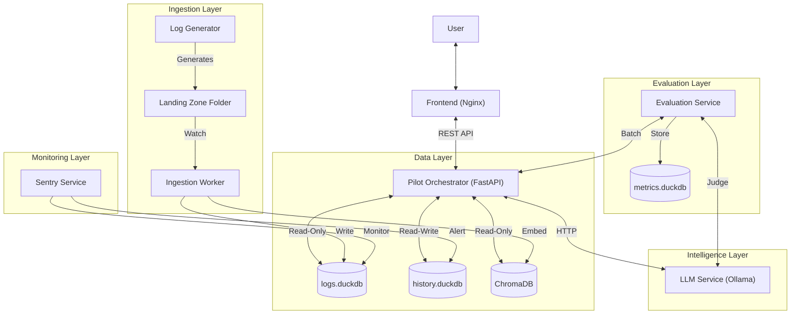

# LogPilot 🚀
**Intelligent Observability Agent**

LogPilot is an AI-powered observability assistant that allows you to query your system logs using natural language. Instead of writing complex SQL or Grep commands, simply ask "How many errors in auth-service?" and get instant answers.

## ✨ Features
- **Natural Language Querying**: Chat with your logs like a human.
- **Multi-Turn Context**: Understands follow-up questions (e.g., "List them", "Show details").
- **Hybrid Intelligence**: Combines **SQL Generation** (for precise data) and **RAG** (for runbooks/knowledge).
- **Modern UI**: Beautiful, dark-mode web interface with chat history.
- **Local-first operation**: Docker and Ollama support local inference; configured cloud providers and opt-in web search can send redacted content externally. See [rendering and egress safeguards](docs/rendering_and_privacy.md).

## 🏗️ Architecture

```mermaid
graph TD
    User[User] <--> Frontend["Frontend (Nginx)"]
    Frontend <--> |REST API| Pilot["Pilot Orchestrator (FastAPI)"]
    
    subgraph "Data Layer"
        Pilot <--> |Read-Only| LogsDB[(logs.duckdb)]
        Pilot <--> |Read-Write| HistoryDB[(history.duckdb)]
        Pilot <--> |Read-Only| VectorDB[(ChromaDB)]
    end
    
    subgraph "Ingestion Layer"
        Generator[Log Generator] --> |Generates| LandingZone[Landing Zone Folder]
        LandingZone --> |Watch| Worker[Ingestion Worker]
        Worker --> |Write| LogsDB
        Worker --> |Embed| VectorDB
    end
    
    subgraph "Intelligence Layer"
        Pilot <--> |HTTP| LLM["LLM Service (Ollama)"]
    end

    subgraph "Evaluation Layer"
        Eval[Evaluation Service] <--> |Batch| Pilot
        Eval <--> |Judge| LLM
        Eval --> |Store| MetricsDB[(metrics.duckdb)]
    end

    subgraph "Monitoring Layer"
        Sentry[Sentry Service] --> |Monitor| LogsDB
        Sentry --> |Alert| HistoryDB
    end
```

## 🛠️ Tech Stack
- **AI/LLM**: Gemma 4 (via Ollama), LangGraph (Orchestration), LlamaIndex (RAG).
- **Backend**: Python, FastAPI, DuckDB (High-performance OLAP).
- **Evaluation**: Ragas, FastAPI (Microservice).
- **Frontend**: Vanilla JS, HTML5, CSS3 (Glassmorphism).
- **Infrastructure**: Docker Compose.

## 🎯 What this demonstrates to employers
This project showcases a production-ready approach to AI Engineering, moving beyond simple wrappers:
- **Advanced Agentic Patterns**: Implements a "Router-Solver" architecture with *LangGraph* that autonomously routes requests (SQL vs RAG) and self-corrects hallucinations.
- **Hybrid RAG Systems**: Solves the "Accuracy vs Flexibility" trade-off by combining **DuckDB** (for precise SQL analytics) with **ChromaDB** (for semantic vector search).
- **Data Engineering & Privacy**: Features a robust ingestion pipeline with regex-based **PII Masking** to sanitize sensitive logs before they touch the database.
- **Microservices Architecture**: Orchestrates 6+ containerized services (FastAPI, React, Vector DB) using Docker Compose, demonstrating full-stack system design.
- **LLM Ops (Evaluation)**: Includes a dedicated evaluation microservice using **Ragas** and "LLM-as-a-Judge" to quantitatively measure performance and prevent regression.

## 💻 System Requirements & LLM Options
LogPilot runs the LLM locally by default, which requires system RAM.

### 1. Default (Recommended)
*   **Model**: `Gemma 4` (Effective 4B).
*   **RAM Required**: ~4GB total system RAM (allocates ~2.5GB for model).
*   **Performance**: Fast reasoning perfectly tuned for local environments.

### 2. High Performance (Workstation / Server)
*   **Model**: `Llama 3` (70B) or `Mixtral` (8x7B).
*   **RAM Required**: ~48GB+ system RAM (or dual GPU setup).
*   **Performance**: GPT-4 class reasoning locally.
*   **How to Switch**:
    ```bash
    # In docker-compose.yml
    command: -c "ollama serve & sleep 5 && ollama pull gemma4:26b && wait"
    ```

### 3. Cloud / High Performance (No Local RAM)
If you have low RAM or want GPT-4 class performance, point LogPilot to a cloud provider.
*   **Supported**: OpenAI, Anthropic, Groq.
*   **Configuration**:
    ```bash
    # Set env vars in docker-compose.yml
    LLM_BASE_URL=https://api.openai.com/v1
    LLM_API_KEY=sk-...
    LLM_MODEL=gpt-4o
    ```

## 🚀 How to Use
1.  **Start the System**:
    ```bash
    docker compose up --build -d
    ```
2.  **Access the UI**: Open `http://localhost:3000`.
3.  **Ask Questions**:
    - "How many errors in the last 24 hours?"
    - "Which service has the most failures?"
    - "List the errors in payment-service."
4.  **Evaluate Performance**:
    -   Trigger batch evaluation: `curl -X POST http://localhost:8002/evaluate/batch -d '{}'`

## 💡 Design Thought
LogPilot is built on the **"Router-Solver"** pattern with **Agentic RAG**. A central orchestrator classifies user intent and routes the query to specialized tools:
- **SQL Tool**: Converts questions into DuckDB SQL for hard data analysis.
- **RAG Tool**: Retrieves context from runbooks for troubleshooting advice.
- **Self-Correction**: The agent verifies its own answers (Context Relevance & Hallucination Check) before responding.
- **Query Rewriter**: Ensures multi-turn conversations are robust by rewriting follow-ups into standalone queries.

This architecture ensures high precision (SQL) and helpful context (RAG) while maintaining a natural user experience.

## 🗺️ Roadmap / Next
The current implementation priority is the [enterprise AI learning and reliability roadmap](docs/enterprise_roadmap.md): stabilize existing features, establish trustworthy evaluation, then add security, recoverable ingestion, and operational readiness. The cloud and optimization ideas below are later candidates, not the immediate implementation sequence. Enterprise readiness has not yet been demonstrated.

Current stabilization work adds isolated HTTP/MCP regression coverage and repairs follow-up history serialization and MCP database access.
Graph regression coverage now also protects independent repair limits, strict judge verdicts, and evidence-aware fallback. External search requires `LOGPILOT_ALLOW_WEB_SEARCH=true`; it is disabled by default. Query deadlines, provider-call budgets and bounded workers are described in [request budgets](docs/request_budgets.md). Model/user SQL uses a [restricted execution policy](docs/sql_execution_policy.md) with a row cap and cancellation. Multi-user authorization, process isolation and ingestion recovery remain open.

- **Stateless Architecture (Zero-ETL)**: Transitioning from local DuckDB files to direct S3 Parquet querying (`read_parquet`) to enable infinite scale and stateless compute.
- **Cloud-Native Adaptation**: Building an adapter to query **AWS CloudWatch Logs / Insights** directly, allowing "Bring Your Own Data" without duplication.
- **Storage Optimization**: Implementing log normalization (storing unique Templates + Parameters) to reduce storage footprint by ~90% for high-volume repetitions.
- **RLHF Feedback Loop**: Adding simple "Thumbs Up/Down" buttons in the UI to capture user feedback and automatically fine-tune the Intent Router.

## ⚖️ Evaluation Approach
We don't guess—we measure. The system includes an `evaluation_service` with [versioned evaluation contracts](docs/evaluation_contract.md). Deterministic cases require exact expected answers or SQL results; legacy keyword-only cases are unscored. Failed requests remain in totals.
- **Framework**: Exact-result checks for batch evaluation; optional Ragas judge scores remain separate.
- **Metrics**:
    - **Faithfulness**: Does the answer interpret the logs correctly without making things up?
    - **Answer Relevance**: Does it actually address the user's specific question?
- **Process**: Triggered via API, it runs batch queries and stores scores in `metrics.duckdb` for longitudinal tracking.

## 📚 Documentation Center

### 🟢 For Everyone
-   [**Detailed Architecture**](docs/architecture.md): The blueprint of the system (Flowcharts, Components).
-   [**Project Roadmap & Backlog**](docs/backlog.md): Future plans, risks, and enhancement ideas.
-   [**Enterprise AI Learning Roadmap**](docs/enterprise_roadmap.md): Phased fixes, acceptance gates, rollback procedures, and hands-on learning goals.
-   [**Design History**](docs/design_history/agent_design.md): Evolution of the agentic design.

### 🔵 For Developers
-   [**Isolated Test Environment**](docs/testing_baseline.md): Run the offline baseline with temporary data before changing application behavior.
-   [**Technical Reference**](docs/technical_reference.md): Code structure, modules, and setup.
-   [**API Reference**](docs/api_reference.md): Endpoints and payloads.
-   [**Security Guide**](docs/security_deployment.md): Deployment hardening and PII masking.

### 🟣 For Performance
-   [**Performance Benchmarks**](docs/performance_benchmarks.md): Latency and accuracy metrics.
-   [**Review Findings**](docs/design_review_findings.md): Past architectural reviews.
