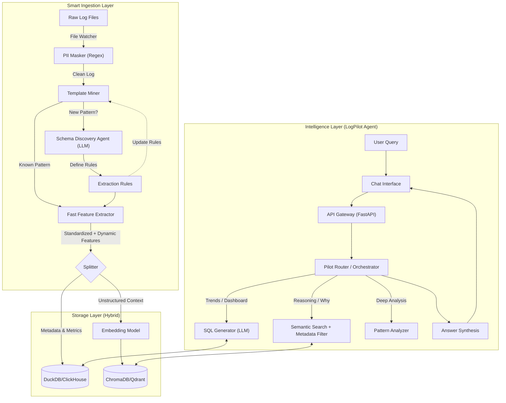

# LogPilot Architecture 🏗️

## Overview
LogPilot uses a **Graph-based Agentic Architecture** (LangGraph) to orchestrate interactions between the user, the LLM, and various tools.

## Core Components

### 1. Pilot Orchestrator (`services/pilot_orchestrator`)
The brain of the system. It runs a state machine graph:
- **Rewrite Query**: First node. Uses LLM to rewrite follow-up questions into standalone queries based on chat history.
- **Classify Intent**: Determines if the query needs SQL (Data) or RAG (Knowledge).
- **Generate SQL**: Converts natural language to DuckDB SQL.
- **Execute SQL**: Runs the query against `logs.duckdb`.
- **Retrieve Context**: Searches `chroma_db` for runbooks.
- **Synthesize Answer**: Combines results and history to generate the final response.

### 2. Ingestion Worker (`services/ingestion-worker`)
Responsible for data processing:
- **Log Ingestion**: Reads raw logs, parses them, and inserts into `logs.duckdb`.
- **Vector Embedding**: Embeds runbooks/docs into ChromaDB for RAG.
- **Schema Management**: Initializes the `logs` table.

### 3. Database Layer (`shared/db`)
We use **DuckDB** for high-performance local analytics.
- **`logs.duckdb`**: Stores log data.
    - **Writer**: Ingestion Worker (Read-Write).
    - **Reader**: Pilot Orchestrator (Read-Only).
- **`history.duckdb`**: Stores chat history.
    - **Writer/Reader**: Pilot Orchestrator (Read-Write).
    - *Separated to prevent locking conflicts.*

### 4. LLM Service (`ollama`)
Runs local models (Llama 3, Phi-3) via Ollama. Exposed via HTTP API to the Pilot.

### 5. Frontend (`services/frontend`)
A lightweight Nginx container serving a static SPA (Single Page App). Connects to Pilot via REST API.

## Data Flow
1.  **User** sends query -> **Frontend** -> **Pilot API**.
2.  **Pilot** fetches history from `history.duckdb`.
3.  **Rewriter** updates query using history.
4.  **Router** decides path (SQL vs RAG).
5.  **Tool** executes (queries `logs.duckdb` or `chroma_db`).
6.  **LLM** synthesizes answer.
7.  **Pilot** saves interaction to `history.duckdb`.
8.  **Response** sent to User.

## Architecture Diagram

