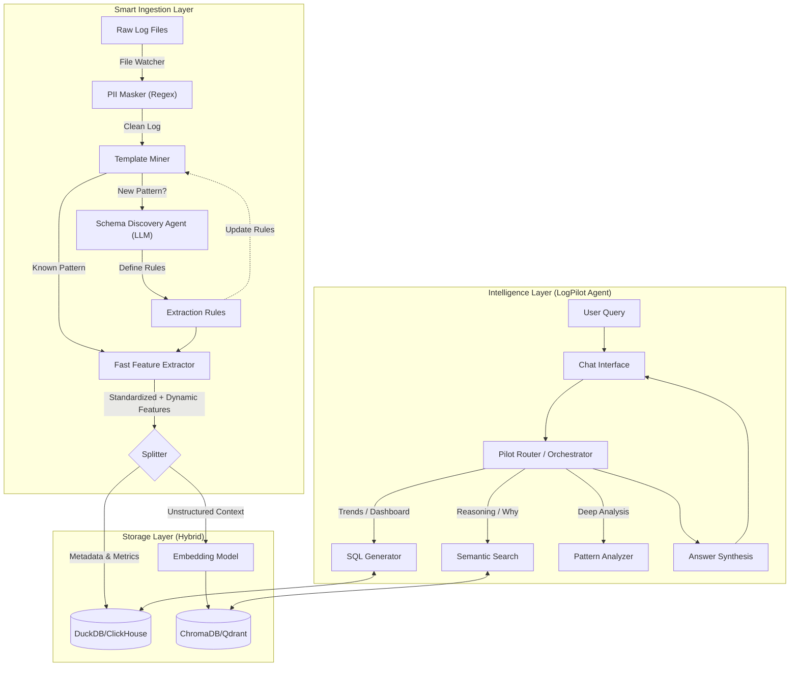
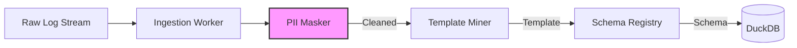

# 🏗️ LogPilot V2: Architecture & Design

**GenAI LogPilot** is an intelligent "Log Agent" capable of ingesting massive volumes of system logs to provide natural language querying, anomaly detection, and high-level status reporting.

---

## 1. Executive Summary

Modern applications generate millions of log lines daily. Most of this is repetitive noise. Finding the "needle in the haystack" (errors, anomalies) is impossible for humans and expensive for traditional AI.

**LogPilot solves this by:**
1.  **Standardizing Noise**: Converting millions of raw logs into a few unique "Templates".
2.  **Thinking Before Acting**: Using an Agentic Orchestrator to plan queries (SQL vs. RAG).
3.  **Business Context**: Mapping technical errors to business owners via a System Catalog.

---

## 2. High-Level Architecture

The system follows a **Data Lakehouse + RAG** architecture, composed of three layers:

1.  **Ingestion Layer**: Cleans, masks PII, and structures raw logs. Supports **Standard, JSON, Syslog, and Nginx** formats via a robust multi-strategy parser.
2.  **Storage Layer**: Hybrid storage using **DuckDB** (Structured) and **ChromaDB** (Unstructured).
3.  **Intelligence Layer**: The "Pilot" agent that interacts with the user.

### Architecture Diagram

---

## 3. Core Design Patterns

### 3.1 Deep Dive: The Standardization Engine (Drain3)

We cannot run an LLM on every log line (too slow/expensive). Instead, we use **Drain3**, a tree-based clustering algorithm, to group logs into **Templates**.

#### 1. How it Works (The Logic)
*   **Initialization**: Sets up the `TemplateMiner` engine with a similarity threshold (e.g., `sim_th=0.5`).
*   **Mining Process**:
    *   **Input**: `User 123 failed login`
    *   **Traversal**: Drain3 navigates its internal tree (e.g., `Length=4` -> `Token1="User"`).
    *   **Decision**: Finds a matching node or creates a new one.
    *   **Output**: `User <ID> failed login` (The "Template").

#### 2. Persistence (`data/drain3_state.bin`)
This file is the **Brain** of the miner.
*   **The Problem**: If the script restarts, it would forget all learned patterns.
*   **The Solution**: Every time a new template is learned, the internal tree is saved to this binary file.
*   **Analogy**:
    *   **The Script**: The student.
    *   **The Log**: The lesson.
    *   **`drain3_state.bin`**: The notebook. Even if the student sleeps (restart), the notes remain.

#### 3. Template vs. Schema (The "Secret Sauce")
They look similar but serve different purposes:

| Feature | **Template** (Drain3) | **Schema** (LLM / Regex) |
| :--- | :--- | :--- |
| **What is it?** | The **Shape** of the text. | The **Meaning** of the data. |
| **Example** | `User <*> failed` | `User (?P<user_id>\w+) failed` |
| **Creator** | Drain3 (Fast, ms). | LLM (Slow, seconds). |
| **Purpose** | **Grouping**. "These 1M logs are Type A." | **Extraction**. "Get me the User ID from Type A." |

### 3.2 Schema Discovery (Self-Healing)
When a new log format appears, the **Schema Discovery Agent**:
1.  **Observes** the new template.
2.  **Generates** a Regex pattern using an LLM.
3.  **Validates** the regex against samples.
4.  **Saves** the rule to the Schema Registry.
*Result*: The system adapts to new services automatically without code changes.

### 3.3 The "JSON Context" Pattern
To handle dynamic fields (e.g., `latency_ms` in Payment vs. `src_ip` in Firewall) without breaking the database schema, we use a hybrid approach:
*   **Golden Fields**: `timestamp`, `service`, `severity` (Columns).
*   **Context**: `{"latency_ms": 500, "src_ip": "10.0.0.1"}` (JSON Column).
*   **Querying**: The Agent generates SQL like `SELECT context->>'latency_ms' ...`.

### 3.4 Example Workflow: "Who owns the failing service?"
This workflow demonstrates how the system combines Structured Data and Knowledge:

1.  **Identify the Service (DuckDB)**
    *   The Agent queries DuckDB: `SELECT system_name, owner_email FROM system_catalog JOIN logs ... ORDER BY error_count DESC LIMIT 1`.
    *   *Result*: "Auth Service (Owner: sec-ops@example.com)".

2.  **Retrieve Context (ChromaDB)**
    *   The Agent searches the Knowledge Base for: *"Auth Service common failures and fixes"*.
    *   *Result*: Retrieved Runbook: "If Auth Service fails with 503, restart the token-generator pod."

3.  **Synthesize Answer**
    *   *Final Output*: "The **Auth Service** is experiencing the most errors. It is owned by **sec-ops@example.com**. The recommended fix is to **restart the token-generator pod**."

---

## 4. Data Flow & Usage

### 4.1 End-to-End Data Flow

### 4.2 Storage Strategy
| Layer | Component | Purpose | Example Query |
|-------|-----------|---------|---------------|
| **Structured** | DuckDB | Quantitative Analytics | "Count errors by Service" |
| **Unstructured** | ChromaDB | Qualitative Knowledge | "Why is Auth failing?" |

---

## 5. Business Intelligence (System Catalog)

Logs tell us *what* broke. The System Catalog tells us *who* cares.
We integrate a `system_catalog` table to map technical services to business owners.

*   **Scenario**: Many-to-Many Relationship.
    *   `auth-service` -> Owned by `Security` AND `Finance`.
*   **Impact Analysis**:
    *   Query: "Who is affected by Auth failures?"
    *   Result: "Security Team (High Priority) and Finance Team (Medium Priority)."

---

## 6. Future Roadmap

### Phase 3: Predictive Analytics
*   **Forecasting**: Use time-series models (Prophet/ARIMA) on DuckDB metrics to predict outages.
*   **Risk Scoring**: Assign risk scores to services based on anomaly trends.

### Phase 4: Workflow Automation
*   **Action Tools**: Allow the Agent to create Jira tickets or Slack alerts.
*   **Human-in-the-Loop**: Require user approval before executing write actions.