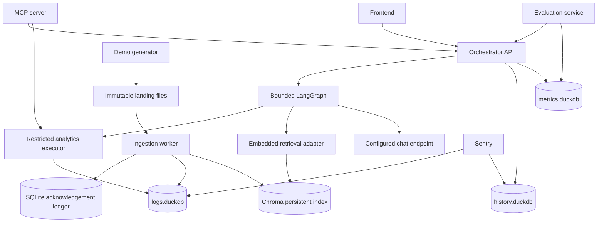
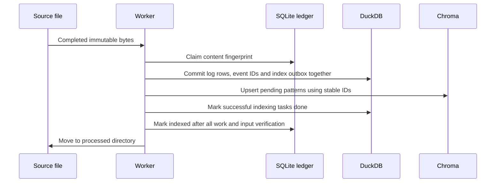

# LogPilot architecture

Current implementation baseline: `4895c91`, 2026-09-17. This is a local prototype with selected reliability controls. Proposed enterprise boundaries and feature designs are in [system design](system_design.md); release gates are in the [roadmap](enterprise_roadmap.md).

## Runtime components

The main Compose file defines eight services. Chroma is embedded persistent storage, not a separate vector-server container.

| Service | Responsibility | Host binding |
|---|---|---|
| `frontend` | Nginx serves vanilla JavaScript/HTML/CSS | `127.0.0.1:3000` |
| `pilot-orchestrator` | FastAPI, LangGraph SQL/RAG routing, conversation and evidence | `127.0.0.1:8000` |
| `llm-service` | Ollama; startup attempts to pull the configured model identifier | `127.0.0.1:11434` |
| `ingestion-worker` | Bounded directory polling, parsing/redaction, Drain3 patterns, durable log/index work | None |
| `sentry-service` | Error-rate polling and persisted alerts | None |
| `mcp-server` | FastMCP SSE tools/resources | `127.0.0.1:8001` |
| `evaluation-service` | Batch contracts, optional Ragas judge, durable evaluation records | `127.0.0.1:8002` |
| `log-generator` | Demo log generation/catalog copy, then stays running | None |

```mermaid
flowchart TD
    UI[Frontend] --> API[Orchestrator API]
    MCP[MCP server] --> API
    MCP --> SQL[Restricted analytics executor]
    API --> G[Bounded LangGraph]
    G --> SQL
    SQL --> LOG[(logs.duckdb)]
    G --> KB[Embedded retrieval adapter]
    KB --> V[(Chroma persistent index)]
    G --> LLM[Configured chat endpoint]
    API --> H[(history.duckdb)]
    GEN[Demo generator] --> F[Immutable landing files]
    F --> W[Ingestion worker]
    W --> LED[(SQLite acknowledgement ledger)]
    W --> LOG
    W --> V
    S[Sentry] --> LOG
    S --> H
    E[Evaluation service] --> API
    E --> MET[(metrics.duckdb)]
    API --> MET
```

Arrows describe logical access, not isolation guarantees. Several processes mount the same data directory. Database constructors still have schema/catalog side effects; storage ownership and concurrent access remain unresolved.

## Query flow and failure boundaries

1. `/query` admits work to a four-slot executor per API process and creates a request budget. `persist_history:false` bypasses API history storage and optionally accepts bounded evaluation context; otherwise the shared default conversation supplies recent context.
2. The graph rewrites/routes the question to SQL, retrieval, web fallback or clarification. SQL repair, context retry and answer retry have independent bounds (3, 2 and 2).
3. Model SQL passes the shared parser/schema/function policy and restricted DuckDB execution. An execution failure cannot be synthesized into a successful answer. Retrieval produces artifact IDs and content hashes; unknown citation IDs fail validation before a model judge.
4. Provider boundaries apply best-effort redaction, timeouts and logical call limits. Search is disabled unless explicitly enabled. Rejected local retrieval is not retained as evidence for a web answer.
5. The graph returns answer, evidence, structured rows, outcome and request provenance, or abstains/fails. The API checks the budget before history persistence. The returned trace is a message transcript, not a complete event audit.

Default HTTP budget is 120 seconds, provider limits 30 seconds for LLM and 10 seconds for search, with 16 LLM calls and one search. A timed-out synchronous operation retains its worker slot until it exits; timeout does not kill a thread or guarantee remote cancellation. History writes already started are not rolled back atomically. See [budgets](request_budgets.md), [SQL policy](sql_execution_policy.md) and [API contracts](api_reference.md).

## Ingestion and recovery flow

Inputs are completed immutable UTF-8 `.log`/`.md` files, at most 8 MiB. Producers should write a temporary file and atomically rename it into the landing directory. Append/tail ingestion is not supported by this adapter.

```mermaid
sequenceDiagram
    participant F as Source file
    participant W as Worker
    participant L as SQLite ledger
    participant D as DuckDB
    participant V as Chroma
    F->>W: Completed immutable bytes
    W->>L: Claim content fingerprint
    W->>D: Commit log rows, event IDs and index outbox together
    W->>V: Upsert pending patterns using stable IDs
    W->>D: Mark successful indexing tasks done
    W->>L: Mark indexed after all work and input verification
    W->>F: Move to processed directory
```

Drain3 owns the serialization format for template snapshots. Explicit saves must use its native snapshot API so reload restores the complete mining tree, template identities and counts. A restart contract uses real pinned Drain3 in disposable storage. This is not a cross-store transaction or a power-loss durability guarantee.

The transaction/outbox flow applies to protocol-2 logs. Event identity combines file fingerprint and physical line number. Replay skips committed records before parsing/mining, then drains pending indexing work. A crash after vector upsert can repeat the same stable-ID upsert. A failed final file move can retry without duplicating completed work. Identical completed content deduplicates even if renamed.

SQLite, DuckDB and Chroma do not share one transaction. Local worker/replay locking and stable IDs bridge these boundaries within a single-writer contract. Failed inputs are quarantined; legacy protocol-1 inputs require review; new Markdown uses a separate durable document journal. Ledger/outbox guards now enforce recovery of older pending log work before admitting newer pattern versions; ordinary startup refuses unresolved log recovery. Pending path memory is bounded through directory polling; distributed leases and legacy vector reconciliation remain future work. See [full recovery protocol](ingestion_recovery.md).

## Evaluation and alerts

Evaluation context is held by the runner per run/conversation and sent as bounded prior question/answer pairs; it never uses expected answers or ordinary user history. Failed turns block only dependent turns, retaining errors in the denominator. The context is ephemeral, not an authenticated session.

Evaluation persists the complete case roster before execution and records passed, failed, error or unscored cases. Exact rows/answers and separate retrieval/citation dimensions replace keyword-only success claims. Failed requests remain in the denominator; latency is measured by the client. Metrics use a real UTC 24-hour window and distinguish unavailable from zero. Dataset hashes and per-request template/model provenance support comparison. Interrupted background runs can remain pending; durable runner resumption is not implemented.

Sentry polls every 10 seconds. Both query windows share one UTC observation time: current `(now−1 minute, now]` and baseline `(now−6 minutes, now−1 minute]`; future timestamps are excluded. It compares the last minute's ERROR/CRITICAL/FATAL count with the preceding five-minute average, using ratio 1.15 and more than five current errors; zero baseline becomes 0.5. A global 60-second cooldown limits alerts. This is a global heuristic, not a learned per-service anomaly model.

## Boundaries still to establish

No authenticated users, tenant authorization, isolated conversations or production deployment qualification exist yet. Embedded storage ownership, document provenance, retention, operational telemetry and backup/restore gates remain open. Kafka, cloud object ingestion, a migration coordinator and automatic fine-tuning are not active components. Older exploratory designs are [historical references](design_history/README.md).

Document recovery is being extended through [ADR 0001](decisions/0001-document-identity.md). New Markdown ingestion now uses its identity/span helper and journals original bytes, the topic plan and immutable card payloads in SQLite before stable-ID vector writes. First-version ingestion and same-version replay are supported; replacement versions and legacy records require review. Whole-document source spans do not prove claim-level support.

Normal intake now retries recognized transient journaled failures with a bounded backoff (default two retries). Permanent unadmitted inputs and invalid document output are quarantined; unknown/partially persisted log failures stop the serialized log pipeline. Read-only recovery inspection avoids loading models. See [retry and inspection semantics](ingestion_recovery.md).

Legacy ledger/vector reconciliation now has a copied-snapshot dry-run tool ([ADR 0002](decisions/0002-legacy-reconciliation.md)). It maps evidence and reports conflicts without modifying original stores; no live migration or automatic legacy ownership assignment is implied.

Pattern retention now tracks monotonic event/index activity and offers dry-run candidates only. Unknown legacy ages are retained. The old destructive cleanup entry point is disabled until operational retention/restore gates pass; no startup cleanup is enabled.
