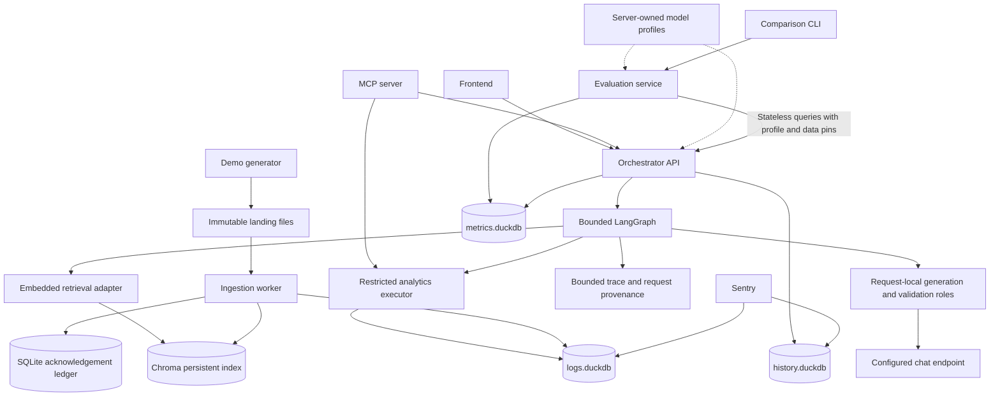
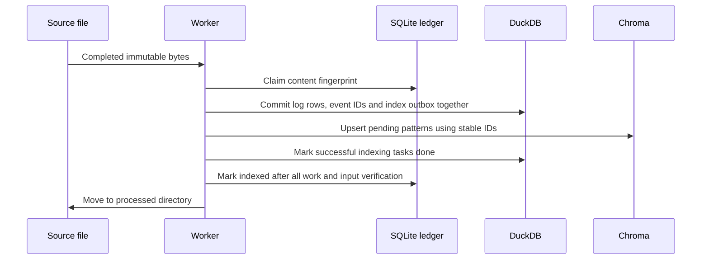
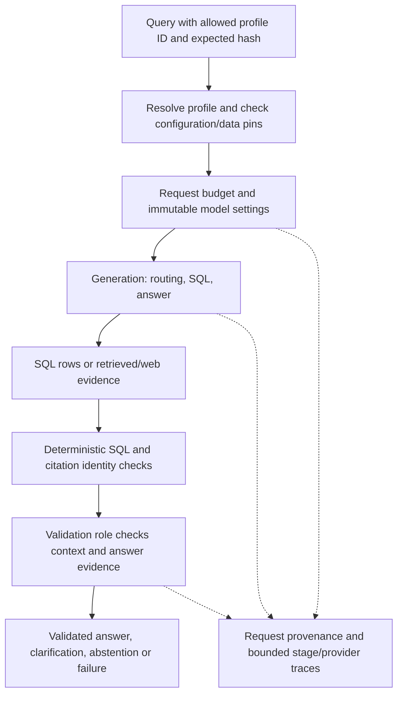

# LogPilot architecture

Reviewed 2026-10-01 against implementation `e190d1f` and status checkpoint `0fb3701`. This document describes implemented code, not a verified running deployment. LogPilot remains a local prototype with tested ingestion recovery, bounded orchestration and controlled model evaluation. Proposed enterprise boundaries are in [system design](system_design.md); release gates are in the [task tracker](implementation_tasks.md).

The latest implementation passed 194 isolated tests and [GitHub CI](https://github.com/Jim-lan/log-pilot/actions/runs/36437720719). Live model quality, shared-user isolation and full-stack readiness remain unproven. See the [current status report](status_2026-10-01.md).

## Runtime components

The main Compose file defines eight services. Chroma is embedded persistent storage, not a separate vector-server container.

| Service | Responsibility | Host binding |
|---|---|---|
| `frontend` | Nginx serves vanilla JavaScript/HTML/CSS | `127.0.0.1:3000` |
| `pilot-orchestrator` | FastAPI, LangGraph SQL/RAG routing, conversation and evidence | `127.0.0.1:8000` |
| `llm-service` | Ollama; startup attempts to pull the configured model identifier | `127.0.0.1:11434` |
| `ingestion-worker` | Bounded directory polling, parsing/redaction, Drain3 patterns, durable log/index work | None |
| `sentry-service` | Error-rate polling and persisted alerts | None |
| `mcp-server` | FastMCP SSE tools/resources | `127.0.0.1:8001` |
| `evaluation-service` | Batch/model comparisons, deterministic scoring, optional Ragas judge, durable records | `127.0.0.1:8002` |
| `log-generator` | Demo log generation/catalog copy, then stays running | None |

```mermaid
flowchart TD
    UI[Frontend] --> API[Orchestrator API]
    MCP[MCP server] --> API
    MCP --> SQL[Restricted analytics executor]
    API --> G[Bounded LangGraph]
    G --> SQL
    SQL --> LOG[(logs.duckdb)]
    G --> KB[Embedded retrieval adapter]
    KB --> V[(Chroma persistent index)]
    C[Server-owned model profiles] -.-> API
    C -.-> E
    G --> P[Request-local generation and validation roles]
    P --> LLM[Configured chat endpoint]
    G --> T[Bounded trace and request provenance]
    API --> H[(history.duckdb)]
    GEN[Demo generator] --> F[Immutable landing files]
    F --> W[Ingestion worker]
    W --> LED[(SQLite acknowledgement ledger)]
    W --> LOG
    W --> V
    S[Sentry] --> LOG
    S --> H
    CLI[Comparison CLI] --> E[Evaluation service]
    E -->|Stateless queries with profile and data pins| API
    E --> MET[(metrics.duckdb)]
    API --> MET
```

Arrows describe logical access, not isolation guarantees. Several processes mount the same data directory. Database constructors still have schema/catalog side effects; storage ownership and concurrent access remain unresolved.

## Query flow and failure boundaries

1. `/query` admits work to a four-slot executor per API process and creates a request budget. `persist_history:false` bypasses API history storage and optionally accepts bounded evaluation context; otherwise the shared default conversation supplies recent context.
2. The graph rewrites/routes the question to SQL, retrieval, web fallback or clarification. SQL repair, context retry and answer retry have independent bounds (3, 2 and 2).
3. Model SQL passes the shared parser/schema/function policy and restricted DuckDB execution. An execution failure cannot be synthesized into a successful answer. Retrieval produces artifact IDs and content hashes; unknown citation IDs fail validation before a model judge.
4. Provider boundaries apply best-effort redaction, timeouts and logical call limits. Search is disabled unless explicitly enabled. Rejected local retrieval is not retained as evidence for a web answer. Web snippets have their own URL/content identities, hashes and retrieval timestamps.
5. The graph returns answer, evidence, structured rows, outcome and request provenance, or abstains/fails. The API checks the budget before history persistence. Trace v2 records bounded request, node and provider spans with IDs, parent links, attempts, timing and sanitized outcomes; it excludes prompts and history. HTTP timeout snapshots may retain running worker spans.

Default HTTP budget is 120 seconds, provider limits 30 seconds for LLM and 10 seconds for search, with 16 LLM calls and one search. A timed-out synchronous operation retains its worker slot until it exits; timeout does not kill a thread or guarantee remote cancellation. History writes already started are not rolled back atomically. See [budgets](request_budgets.md), [SQL policy](sql_execution_policy.md) and [API contracts](api_reference.md).

## Ingestion and recovery flow

Inputs are completed immutable UTF-8 `.log`/`.md` files, at most 8 MiB. Producers should write a temporary file and atomically rename it into the landing directory. Append/tail ingestion is not supported by this adapter.

```mermaid
sequenceDiagram
    participant F as Source file
    participant W as Worker
    participant L as SQLite ledger
    participant D as DuckDB
    participant V as Chroma
    F->>W: Completed immutable bytes
    W->>L: Claim content fingerprint
    W->>D: Commit log rows, event IDs and index outbox together
    W->>V: Upsert pending patterns using stable IDs
    W->>D: Mark successful indexing tasks done
    W->>L: Mark indexed after all work and input verification
    W->>F: Move to processed directory
```

Drain3 owns the serialization format for template snapshots. Explicit saves must use its native snapshot API so reload restores the complete mining tree, template identities and counts. A restart contract uses real pinned Drain3 in disposable storage. This is not a cross-store transaction or a power-loss durability guarantee.

The transaction/outbox flow applies to protocol-2 logs. Event identity combines file fingerprint and physical line number. Replay skips committed records before parsing/mining, then drains pending indexing work. A crash after vector upsert can repeat the same stable-ID upsert. A failed final file move can retry without duplicating completed work. Identical completed content deduplicates even if renamed.

SQLite, DuckDB and Chroma do not share one transaction. Local worker/replay locking and stable IDs bridge these boundaries within a single-writer contract. Failed inputs are quarantined; legacy protocol-1 inputs require review; new Markdown uses a separate durable document journal. Ledger/outbox guards now enforce recovery of older pending log work before admitting newer pattern versions; ordinary startup refuses unresolved log recovery. Pending path memory is bounded through directory polling; distributed leases remain future work; legacy reconciliation is available as copied-snapshot dry-run tooling. See [full recovery protocol](ingestion_recovery.md).

## Evaluation and alerts

Evaluation context is held by the runner per run/conversation and sent as bounded prior question/answer pairs; it never uses expected answers or ordinary user history. Failed turns block only dependent turns, retaining errors in the denominator. The context is ephemeral, not an authenticated session.

Evaluation persists the complete case roster before execution and records passed, failed, error or unscored cases. Exact rows/answers and separate retrieval/citation dimensions replace keyword-only success claims. Reviewed exact-claim fixtures measure citation coverage and support against specific artifact hashes; valid IDs alone cannot establish support. Unreviewed support remains null. Failed requests remain in the denominator; latency is measured by the client. Metrics use a real UTC 24-hour window and distinguish unavailable from zero. Dataset hashes, explicit dataset version/split for v2 envelopes and per-request template/model provenance support comparison. The published held-out synthetic partition exercises exact SQL and source-fact/abstention scoring; it is not evidence of live-model accuracy. An exclusive local evaluator owner marks abandoned runs interrupted on startup, preserving completed cases and counting pending cases as errors. Model/template/scorer identities and per-status totals reconcile with case records; requests are not automatically resumed.

Sentry polls every 10 seconds. Both query windows share one UTC observation time: current `(now−1 minute, now]` and baseline `(now−6 minutes, now−1 minute]`; future timestamps are excluded. It compares the last minute's ERROR/CRITICAL/FATAL count with the preceding five-minute average, using ratio 1.15 and more than five current errors; zero baseline becomes 0.5. A global 60-second cooldown limits alerts. This is a global heuristic, not a learned per-service anomaly model.

## Boundaries still to establish

No authenticated users, tenant authorization, isolated conversations or production deployment qualification exist yet. Embedded storage ownership, precise claim-level source spans, replacement-version activation, enforced retention, broader operational telemetry and backup/restore gates remain open. Kafka, cloud object ingestion, a migration coordinator and automatic fine-tuning are not active components. Older exploratory designs are [historical references](design_history/README.md).

Document recovery implements [ADR 0001](decisions/0001-document-identity.md). New Markdown ingestion now uses its identity/span helper and journals original bytes, the topic plan and immutable card payloads in SQLite before stable-ID vector writes. First-version ingestion and same-version replay are supported; replacement versions and legacy records require review. Whole-document source spans do not prove claim-level support.

Normal intake now retries recognized transient journaled failures with a bounded backoff (default two retries). Permanent unadmitted inputs and invalid document output are quarantined; unknown/partially persisted log failures stop the serialized log pipeline. Read-only recovery inspection avoids loading models. See [retry and inspection semantics](ingestion_recovery.md).

Legacy ledger/vector reconciliation now has a copied-snapshot dry-run tool ([ADR 0002](decisions/0002-legacy-reconciliation.md)). It maps evidence and reports conflicts without modifying original stores; no live migration or automatic legacy ownership assignment is implied.

Pattern retention now tracks monotonic event/index activity and offers dry-run candidates only. Unknown legacy ages are retained. The old destructive cleanup entry point is disabled until operational retention/restore gates pass; no startup cleanup is enabled.

## Model control and validation

Model selection is opt-in through `LOGPILOT_MODEL_PROFILES_PATH`. Both the
orchestrator and evaluator load the server-owned catalog. Clients select an
allowed profile ID; they cannot supply an endpoint or credentials. Ordinary
chat keeps its existing configuration. Profile selection requires
`persist_history:false`, so experiments do not change shared chat history or
mutate the default model registry.

Each frozen profile separates generation from validation and records model tag,
temperature, top-p, seed, output-token cap and optional reasoning effort. The
request budget carries the resolved settings. The shared LLM client routes
`fast`, `smart` and `reasoning` roles to the selected generator, and `validator`
to the selected validator. Without a profile, the validator uses the existing
fast-model configuration. Embeddings, ingestion synthesis and the optional
Ragas endpoint are separate paths, not controlled by this comparison profile.

```mermaid
flowchart TD
    Q[Query with allowed profile ID and expected hash] --> PIN[Resolve profile and check configuration/data pins]
    PIN --> B[Request budget and immutable model settings]
    B --> G[Generation: routing, SQL, answer]
    G --> E[SQL rows or retrieved/web evidence]
    E --> D[Deterministic SQL and citation identity checks]
    D --> V[Validation role checks context and answer evidence]
    V --> O[Validated answer, clarification, abstention or failure]
    B -.-> T[Request provenance and bounded stage/provider traces]
    G -.-> T
    V -.-> T
```

This diagram summarizes responsibilities; graph routing and bounded retries can
revisit stages. Runtime validation receives actual SQL or retrieved/web evidence.
A judge acceptance is recorded separately from offline correctness. Deterministic
citation identity checks reject unknown IDs but do not prove semantic support.

## Comparison execution and release decision

```mermaid
sequenceDiagram
    participant U as CLI or API caller
    participant E as Evaluation service
    participant S as Evaluation store
    participant A as Orchestrator
    participant M as Model endpoint
    U->>E: Profiles, repetitions, data revision, optional gates
    E->>E: Load dataset/catalog; require identical validator settings
    E->>S: Atomically persist every run and case roster
    loop Serial candidate runs with rotated order across repetitions
        E->>A: Stateless query, isolated context, profile/data pins
        A->>A: Reject changed pins before provider work
        A->>M: Generation and evidence-aware validation
        M-->>A: Response and available usage
        A-->>E: Outcome, evidence, rows, trace and provenance
        E->>S: Deterministic scores and per-case results
    end
    U->>E: Fetch comparison report
    E->>S: Read persisted evidence
    E-->>U: Metrics, provenance checks and gated recommendation
```

`POST /evaluate/compare` admits 2–4 profiles, 1–5 repetitions and at most 5,000
case executions. Only one batch/comparison job runs per evaluator. Each
candidate/repetition has independent ephemeral conversation context; expected
answers remain in the scorer and are never sent as query context. A startup
owner lock prevents competing evaluators and marks abandoned runs interrupted,
preserving completed cases without automatically replaying requests.

`GET /evaluate/comparisons/{id}` separates pass/error/unscored rates, latency
p50/p95, citation dimensions, validator acceptance and available token usage.
Missing usage remains unavailable; no monetary cost is inferred. Unexpected
abstention cannot pass merely because SQL rows match. Recommendations require
complete scored results, matching observed provenance and all explicit
quality/error/latency gates. Exact ties produce no recommendation. Default-model
promotion remains a separate reviewed action.

## Traceability and remaining evidence gaps

| Record | Implemented evidence | Limit |
|---|---|---|
| Model execution | Profile/endpoint fingerprints, requested settings, returned model names, available usage | Tags/names are not verified weight digests; context/runtime configuration is external |
| Prompts and scoring | Template hashes, scorer identity, reporter fingerprint | Stable hashes do not prove correctness |
| Evaluation input | Dataset hash/version/split, case order, comparison plan and data revision | Data revision is an operator assertion, not a database/vector snapshot |
| Request execution | Bounded request/node/provider spans, parent IDs, attempts, timing and sanitized outcomes | No forced cancellation of synchronous work; traces exclude prompt/history content |
| Quality | Deterministic expected rows/answers and reviewed citation claims; separate judge result | Synthetic coverage and judge approval do not establish live accuracy |

The next architecture increment is Q07: frozen disposable SQL/vector fixtures,
live repeated comparisons and reviewed thresholds. Stronger model/data identity,
judge-error audits and memory/runtime measurements improve reproducibility.
Authentication and workspace scope, explicit storage owners, bounded SQL process
execution, deploy/rollback tests and restore drills remain required before a
shared pilot. These are planned boundaries, not present components.

See [harness setup and configuration](model_harness.md),
[evaluation contracts](evaluation_contract.md) and
[prioritized improvement plan](status_2026-10-01.md).
