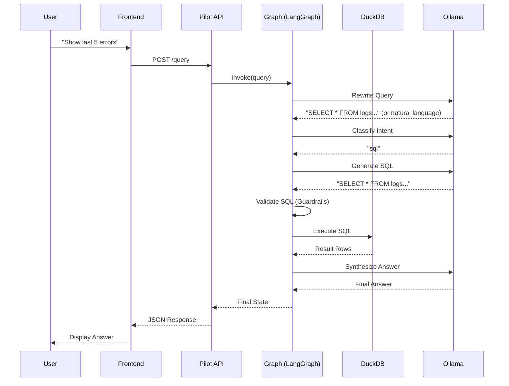
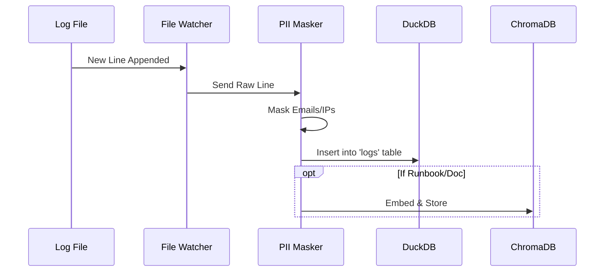

# Detailed Architecture 🏗️

## 1. Component Diagram

The LogPilot system consists of 5 main containerized services:

```mermaid
graph TD
    User[User] <--> Frontend[Frontend (Nginx)]
    Frontend <--> |REST API| Pilot[Pilot Orchestrator (FastAPI)]
    
    subgraph "Data Layer"
        Pilot <--> |Read-Only| LogsDB[(logs.duckdb)]
        Pilot <--> |Read-Write| HistoryDB[(history.duckdb)]
        Pilot <--> |Read-Only| VectorDB[(ChromaDB)]
    end
    
    subgraph "Ingestion Layer"
        LogFiles[Log Files] --> |Watch| Worker[Ingestion Worker]
        Worker --> |Write| LogsDB
        Worker --> |Embed| VectorDB
    end
    
    subgraph "Intelligence Layer"
        Pilot <--> |HTTP| LLM[LLM Service (Ollama)]
    end
```

## 2. Sequence Diagrams

### A. User Query Flow (End-to-End)



### B. Ingestion Flow



## 3. Service Details

### Pilot Orchestrator
-   **Framework**: FastAPI + LangGraph.
-   **Role**: Manages the cognitive architecture (Rewrite -> Plan -> Execute -> Verify).
-   **State Management**: Uses `langgraph` StateGraph to pass context between nodes.

### Ingestion Worker
-   **Role**: Real-time log processing.
-   **Mechanism**: Uses `watchdog` to monitor file system events.
-   **PII Masking**: Regex-based masking for emails, IP addresses, and SSNs before storage.

### Database Layer
-   **DuckDB**: Chosen for high-performance OLAP queries on local files.
-   **ChromaDB**: Vector store for RAG (Retrieval Augmented Generation).

## 4. Storage Optimization Strategy

The current architecture prioritizes **simplicity and context** for the LLM by storing full log bodies. However, for high-volume production environments, a **Log Normalization** strategy is designed and feasible.

### Option A: Full Log Storage (Current)
-   **Schema**: `timestamp`, `service`, `severity`, `body` (full text), `template_id`.
-   **Pros**: Zero reconstruction cost, easy debugging, full-text search.
-   **Cons**: Higher storage footprint (redundant text).
-   **Best For**: AI Agents (needs exact context), <1TB scale.

### Option B: Normalized Storage (Future Optimization)
-   **Schema**: `timestamp`, `service`, `severity`, `template_id`, `parameters` (JSON list).
-   **Mechanism**:
    1.  `LogTemplateMiner` extracts template (e.g., "User <*> failed") and parameters (e.g., `["bob"]`).
    2.  Store only the parameters in DuckDB.
    3.  Reconstruct log message dynamically for display or LLM context.
-   **Pros**: Minimal storage (up to 90% reduction for repetitive logs), efficient analytics on parameters.
-   **Cons**: Reconstruction overhead, complexity in search (cannot grep raw text).
-   **Feasibility**: Verified via `tests/check_drain3.py` that `drain3` supports parameter extraction.

## 5. Vector DB Usage Scenarios

The Vector DB (ChromaDB) is the "Semantic Brain" of LogPilot. It is used when the user's question is **vague, qualitative, or pattern-based**.

### Example 1: Semantic Discovery ("What's wrong?")
*   **User Query**: *"Are there any authentication issues?"*
*   **Why Vector DB?**: The word "issues" is subjective. SQL can't query `WHERE body LIKE '%issue%'` effectively.
*   **The Flow**:
    1.  **Embed**: Convert query to vector.
    2.  **Search**: Find patterns near "authentication" and "error/fail".
    3.  **Match**: ChromaDB returns pattern `User <*> failed to login`.
    4.  **Retrieve**: System uses the pattern's `template_id` to fetch recent logs from DuckDB.
    5.  **Answer**: "Yes, I found a recurring pattern of login failures..."

### Example 2: Pattern Matching ("Find logs like this")
*   **User Query**: *"Show me logs similar to the database timeout."*
*   **Why Vector DB?**: "Similar to" is a vector operation.
*   **The Flow**:
    1.  **Search**: ChromaDB finds the `Database connection timed out after <*> ms` pattern.
    2.  **Retrieve**: Uses `template_id` to get specific instances.

### Example 3: When is it NOT used? (Pure SQL)
*   **User Query**: *"Count the number of errors in the last hour."*
*   **Why NOT Vector DB?**: This is a precise, quantitative question.
*   **The Flow**:
    1.  **Intent Classifier**: Detects "SQL" intent.
    2.  **Generate SQL**: `SELECT count(*) FROM logs WHERE severity='ERROR' AND timestamp > now() - INTERVAL 1 HOUR`.
    3.  **Execute**: Runs directly on DuckDB. Vector DB is bypassed completely.
