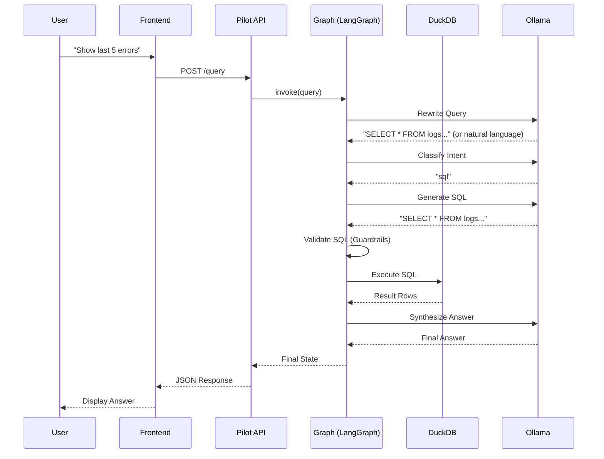
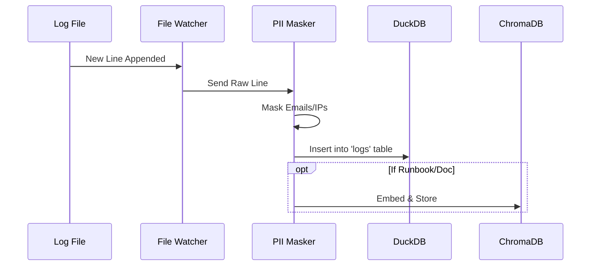

# Detailed Architecture 🏗️

## 1. Component Diagram

The LogPilot system consists of 5 main containerized services:

```mermaid
graph TD
    User[User] <--> Frontend[Frontend (Nginx)]
    Frontend <--> |REST API| Pilot[Pilot Orchestrator (FastAPI)]
    
    subgraph "Data Layer"
        Pilot <--> |Read-Only| LogsDB[(logs.duckdb)]
        Pilot <--> |Read-Write| HistoryDB[(history.duckdb)]
        Pilot <--> |Read-Only| VectorDB[(ChromaDB)]
    end
    
    subgraph "Ingestion Layer"
        LogFiles[Log Files] --> |Watch| Worker[Ingestion Worker]
        Worker --> |Write| LogsDB
        Worker --> |Embed| VectorDB
    end
    
    subgraph "Intelligence Layer"
        Pilot <--> |HTTP| LLM[LLM Service (Ollama)]
    end
```

## 2. Sequence Diagrams

### A. User Query Flow (End-to-End)



### B. Ingestion Flow



## 3. Service Details

### Pilot Orchestrator
-   **Framework**: FastAPI + LangGraph.
-   **Role**: Manages the cognitive architecture (Rewrite -> Plan -> Execute -> Verify).
-   **State Management**: Uses `langgraph` StateGraph to pass context between nodes.

### Ingestion Worker
-   **Role**: Real-time log processing.
-   **Mechanism**: Uses `watchdog` to monitor file system events.
-   **PII Masking**: Regex-based masking for emails, IP addresses, and SSNs before storage.

### Database Layer
-   **DuckDB**: Chosen for high-performance OLAP queries on local files.
-   **ChromaDB**: Vector store for RAG (Retrieval Augmented Generation).

## 4. Storage Optimization Strategy

The current architecture prioritizes **simplicity and context** for the LLM by storing full log bodies. However, for high-volume production environments, a **Log Normalization** strategy is designed and feasible.

### Option A: Full Log Storage (Current)
-   **Schema**: `timestamp`, `service`, `severity`, `body` (full text), `template_id`.
-   **Pros**: Zero reconstruction cost, easy debugging, full-text search.
-   **Cons**: Higher storage footprint (redundant text).
-   **Best For**: AI Agents (needs exact context), <1TB scale.

### Option B: Normalized Storage (Future Optimization)
-   **Schema**: `timestamp`, `service`, `severity`, `template_id`, `parameters` (JSON list).
-   **Mechanism**:
    1.  `LogTemplateMiner` extracts template (e.g., "User <*> failed") and parameters (e.g., `["bob"]`).
    2.  Store only the parameters in DuckDB.
    3.  Reconstruct log message dynamically for display or LLM context.
-   **Pros**: Minimal storage (up to 90% reduction for repetitive logs), efficient analytics on parameters.
-   **Cons**: Reconstruction overhead, complexity in search (cannot grep raw text).
-   **Feasibility**: Verified via `tests/check_drain3.py` that `drain3` supports parameter extraction.

## 5. Vector DB Usage Scenarios

The Vector DB (ChromaDB) is the "Semantic Brain" of LogPilot. It is used when the user's question is **vague, qualitative, or pattern-based**.

### Example 1: Semantic Discovery ("What's wrong?")
*   **User Query**: *"Are there any authentication issues?"*
*   **Why Vector DB?**: The word "issues" is subjective. SQL can't query `WHERE body LIKE '%issue%'` effectively.
*   **The Flow**:
    1.  **Embed**: Convert query to vector.
    2.  **Search**: Find patterns near "authentication" and "error/fail".
    3.  **Match**: ChromaDB returns pattern `User <*> failed to login`.
    4.  **Retrieve**: System uses the pattern's `template_id` to fetch recent logs from DuckDB.
    5.  **Answer**: "Yes, I found a recurring pattern of login failures..."

### Example 2: Pattern Matching ("Find logs like this")
*   **User Query**: *"Show me logs similar to the database timeout."*
*   **Why Vector DB?**: "Similar to" is a vector operation.
*   **The Flow**:
    1.  **Search**: ChromaDB finds the `Database connection timed out after <*> ms` pattern.
    2.  **Retrieve**: Uses `template_id` to get specific instances.

### Example 3: When is it NOT used? (Pure SQL)
*   **User Query**: *"Count the number of errors in the last hour."*
*   **Why NOT Vector DB?**: This is a precise, quantitative question.
*   **The Flow**:
    1.  **Intent Classifier**: Detects "SQL" intent.
    2.  **Generate SQL**: `SELECT count(*) FROM logs WHERE severity='ERROR' AND timestamp > now() - INTERVAL 1 HOUR`.
    3.  **Execute**: Runs directly on DuckDB. Vector DB is bypassed completely.

## 6. Production Data Architecture: Stateless on S3

In our current **Demo/MVP** environment, we ingest logs into a local DuckDB file (`logs.duckdb`). In a **Real-World Production** environment, we recommend a **Stateless Architecture** that queries data directly where it lives (e.g., S3), avoiding data duplication.

### A. Current Approach (Local Storage)
*   **Mechanism**: Ingestion Worker reads logs -> Inserts into local `logs.duckdb` file.
*   **Pros**: Extremely fast for small/medium datasets, simple setup, no network latency.
*   **Cons**: Data duplication (logs exist in file & DB), limited by local disk, stateful (harder to scale horizontally).

### B. Production Approach (Stateless on S3)
*   **Concept**: Treat S3 as the database. DuckDB acts as a **stateless compute engine** that queries Parquet files directly on S3.
*   **Mechanism**:
    1.  **Log Storage**: Logs are shipped to S3 in Parquet format (e.g., via Kinesis Firehose or FluentBit).
    2.  **Compute**: LogPilot spins up a DuckDB instance (in Lambda or Container) only when a query is needed.
    3.  **Query**: `SELECT * FROM 's3://my-log-bucket/date=2024-01-01/*.parquet'`.
*   **Pros**:
    *   **Zero Data Movement**: No need to "ingest" or move data into a separate DB.
    *   **Infinite Scale**: S3 handles the storage; DuckDB handles the compute.
    *   **Cost Effective**: Pay only for S3 storage and query compute time.

### How to Achieve This
To transition LogPilot to this architecture:

1.  **Install Extensions**:
    ```sql
    INSTALL httpfs;
    LOAD httpfs;
    INSTALL aws;
    LOAD aws;
    ```

2.  **Configure Credentials**:
    ```python
    con.execute("CALL load_aws_credentials()")
    ```

3.  **Query Directly**:
    ```python
    # Instead of querying a local table 'logs'
    sql = "SELECT count(*) FROM read_parquet('s3://company-logs/service-a/*.parquet')"
    con.execute(sql)
    ```

This allows LogPilot to become a **Zero-ETL** agent, providing intelligence on top of your existing Data Lake.

## 7. Cloud-Native Adaptation: AWS CloudWatch ☁️

For environments where logs are stored in **AWS CloudWatch Logs** (e.g., AWS Glue jobs), we can adapt LogPilot to query them directly without ingestion, acting as a smart UI over the CloudWatch API.

### Architecture Changes
To support the "Live CloudWatch Log Access" pattern, we swap specific components while keeping the core cognitive architecture:

| Component | Current (DuckDB) | Cloud-Native (CloudWatch) |
| :--- | :--- | :--- |
| **Intent Router** | `classify_intent` (Same) | `classify_intent` (Same) |
| **Generator** | `SQLGenerator` (DuckDB SQL) | **`InsightsGenerator`** (CloudWatch Syntax) |
| **Executor** | `DuckDBConnector` | **`CloudWatchConnector`** (Boto3) |
| **Vector DB** | Ingests all patterns | **Pattern Sampler** (Ingests patterns from samples) |

### Implementation Strategy

#### 1. Insights Generator (The "Translator")
We create a new prompt in `PromptFactory` to translate natural language into CloudWatch Insights syntax.

**Prompt Template**:
```text
You are an AWS CloudWatch Expert.
Translate the user question: "{query}"
Into CloudWatch Logs Insights syntax.

Example:
Q: "Show me the last 20 errors"
A: fields @timestamp, @message | filter @message like /ERROR/ | sort @timestamp desc | limit 20
```

#### 2. CloudWatch Connector (The "Executor")
We implement a connector using `boto3` to execute the generated query.

```python
import boto3
import time

class CloudWatchConnector:
    def __init__(self, log_group: str):
        self.client = boto3.client('logs')
        self.log_group = log_group

    def query(self, query_string: str):
        # 1. Start Query
        response = self.client.start_query(
            logGroupName=self.log_group,
            startTime=int((time.time() - 3600) * 1000), # Default 1h lookback
            endTime=int(time.time() * 1000),
            queryString=query_string
        )
        query_id = response['queryId']
        
        # 2. Poll for Results
        while True:
            res = self.client.get_query_results(queryId=query_id)
            if res['status'] in ['Complete', 'Failed', 'Cancelled']:
                return res['results']
            time.sleep(1)
```

#### 3. Smart RAG Fallback
If the user asks a qualitative question ("Why did the job fail?"), we use a **Hybrid Flow**:
1.  **Retrieve**: Fetch recent error logs via CloudWatch Insights (`filter @message like /ERROR/`).
2.  **Pattern**: Run `LogTemplateMiner` on the *retrieved results* in-memory.
3.  **Augment**: Feed the unique patterns + sample errors into the LLM to synthesize an answer.

This approach achieves **Zero Data Duplication** while leveraging LogPilot's agentic capabilities.
