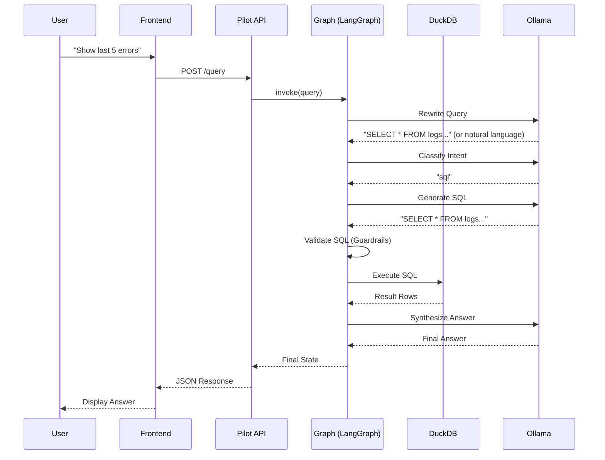
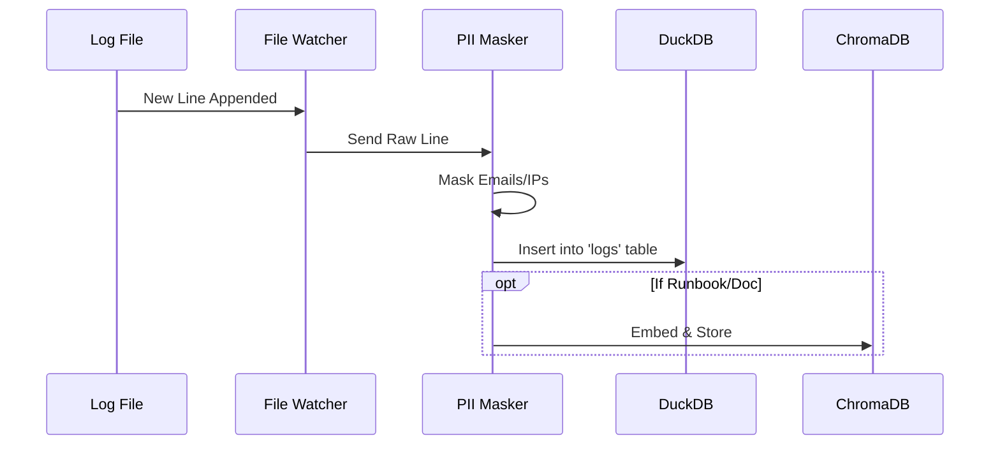

# Detailed Architecture 🏗️

## 1. Component Diagram

The LogPilot system consists of 5 main containerized services:

```mermaid
graph TD
    User[User] <--> Frontend[Frontend (Nginx)]
    Frontend <--> |REST API| Pilot[Pilot Orchestrator (FastAPI)]
    
    subgraph "Data Layer"
        Pilot <--> |Read-Only| LogsDB[(logs.duckdb)]
        Pilot <--> |Read-Write| HistoryDB[(history.duckdb)]
        Pilot <--> |Read-Only| VectorDB[(ChromaDB)]
    end
    
    subgraph "Ingestion Layer"
        LogFiles[Log Files] --> |Watch| Worker[Ingestion Worker]
        Worker --> |Write| LogsDB
        Worker --> |Embed| VectorDB
    end
    
    subgraph "Intelligence Layer"
        Pilot <--> |HTTP| LLM[LLM Service (Ollama)]
    end
```

## 2. Sequence Diagrams

### A. User Query Flow (End-to-End)



### B. Ingestion Flow



## 3. Service Details

### Pilot Orchestrator
-   **Framework**: FastAPI + LangGraph.
-   **Role**: Manages the cognitive architecture (Rewrite -> Plan -> Execute -> Verify).
-   **State Management**: Uses `langgraph` StateGraph to pass context between nodes.

### Ingestion Worker
-   **Role**: Real-time log processing.
-   **Mechanism**: Uses `watchdog` to monitor file system events.
-   **PII Masking**: Regex-based masking for emails, IP addresses, and SSNs before storage.

### Database Layer
-   **DuckDB**: Chosen for high-performance OLAP queries on local files.
-   **ChromaDB**: Vector store for RAG (Retrieval Augmented Generation).
