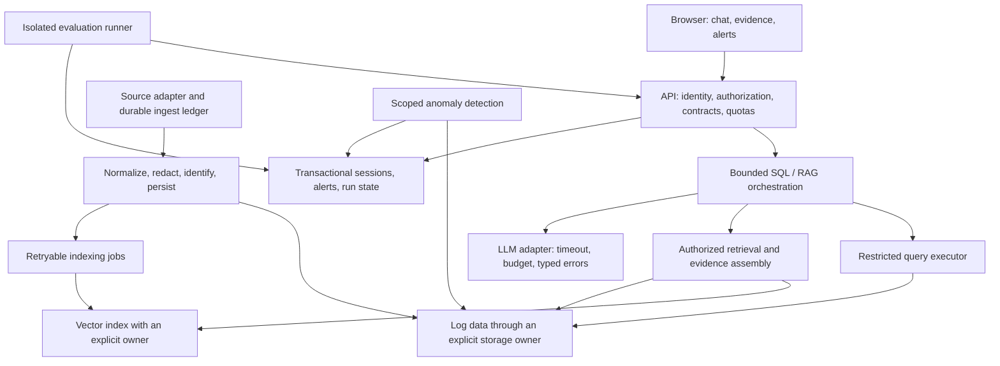

# LogPilot: reliability and enterprise AI learning roadmap

Date: 2026-09-10  
Status: Step 0.1 complete. API/MCP and real graph contracts protect history/MCP fixes and bounded repair paths. Step 1.2 query/provider budgets implemented; broader coverage and tracing remain open.

Next implementation step: **1.3 safe rendering and comprehensive egress handling**, alongside remaining 0.2 coverage. See [request budget design](request_budgets.md) for the completed controls and cancellation limitations.

Evidence and run instructions: [isolated test baseline](testing_baseline.md).

## 1. Purpose and honest starting point

Develop LogPilot into a dependable internal AI assistant while learning how to design, test, secure, operate, and evolve enterprise AI systems. Preserve natural-language SQL analysis, hybrid retrieval, template mining, runbook knowledge, conversation continuity, inspectable evidence, and proactive alerts.

The current project is a prototype with useful architectural foundations. The September review identified concrete correctness defects and incomplete operational controls. Existing documentation and benchmark claims are not evidence of production readiness.

The review combined source inspection and isolated execution of selected function bodies with stubbed dependencies. It reproduced history serialization and retry defects, a missing graph destination, and a masking gap. It did not run the full Docker stack, a penetration test, or a load test. Full application verification is a deliverable of this roadmap.

This document defines the implementation order. The [backlog](backlog.md) remains an idea inventory. The [architecture](architecture.md) describes existing concepts and future options; the target below is proposed, not deployed.

## 2. Principles that protect the good features

1. Change one behavior at a time. Each numbered step is a separate reviewable change; split further if needed.
2. Establish a failing regression test before repairing a confirmed defect. Preserve working behavior with a small set of deterministic feature contracts.
3. Keep model/prompt experiments separate from storage, security, and routing changes so failures have an identifiable cause.
4. Use synthetic fixtures and disposable databases. Never run reset scripts or migrations against the user's existing data as a test shortcut.
5. Keep normal response fields compatible where practical; add structured evidence and status fields before retiring older fields. Security fixes may intentionally reject previously accepted unsafe inputs.
6. Require evidence for claims: a syntax-valid query is not necessarily correct, a judge score is not proof, and a green health endpoint is not proof of readiness.
7. Keep the local development experience. Add enterprise controls in layers; select infrastructure based on measured requirements.
8. No promise of zero regressions. Reduce risk with narrow changes, automated checks, isolated rollout, and exercised recovery.

## 3. Scope and release stages

| Stage | Intended use | Exit conditions |
|---|---|---|
| R0 — reproducible baseline | Developer only, synthetic data | Known failures recorded; tests cannot affect existing data; core feature fixtures established |
| R1 — dependable local demo | Developer only | Conversation, SQL, RAG, bounded failure, and MCP contracts pass; basic unsafe rendering/egress addressed |
| R2 — measured local assistant | Developer only | Evaluation consumes real evidence; failed cases remain visible; quality baseline reproducible |
| R3 — candidate internal pilot | Restricted test environment | Identity, authorization, durable ingestion/storage, deployment and recovery gates pass |
| R4 — controlled internal pilot | Small explicitly scoped user group | Isolation, load, restore and incident exercises pass against agreed objectives |
| R5 — expanded capabilities | Only workloads meeting prior gates | Each enhancement passes quality, cost, security and compatibility checks |

R3 is a candidate, not permission to expose the application. Shared use starts only after the operational gates in Phase 6. No public or sensitive-data deployment is part of the initial stabilization steps. Commits, pushes, deployments, and destructive data operations remain separate from this design work.

## 4. Proposed target boundaries

These are logical boundaries, not a requirement for one container per box. The local implementation may keep several modules together. One owner for embedded storage is an initial option; a server database for transactional state is another. Phase 5 records the decision with concurrency and recovery evidence before a migration. DuckDB can remain useful for analytics.

The API owns user/workspace permissions; the model never decides authorization. SQL and vector retrieval enforce that scope before data reaches the prompt. Evidence retains source identity, version, timestamp and retrieval scope. Model responses cannot create new privileges.

## 5. Implementation sequence

### Phase 0 — establish a trustworthy baseline

**0.1 — isolate and inventory.** Inspect test import side effects, dependency setup, data paths and demo commands. Create a documented test profile using temporary storage and synthetic logs/runbooks, with external LLM/search calls stubbed. Record the exact starting revision, dependency/model configuration and known failures. Do not initialize project data while collecting tests.

**0.2 — protect core behavior.** Establish the contracts in Section 6. Repair stale test setup that patches removed symbols, without changing application behavior to satisfy outdated expectations. Add a small repeatable CI suite once the local suite is isolated. Classify existing failures explicitly; any temporary expected failure must reference a roadmap step and disappear with its fix.

Gate: repeatable results in a clean test environment; existing data untouched; working contracts pass; known failures visible rather than silently skipped. A broken baseline must not be reported as a passing release.

Learning: characterization tests, test doubles versus integration tests, reproducibility, and distinguishing a test harness defect from a product defect.

### Phase 1 — repair local correctness and basic safety

**1.1 — restore conversation and MCP contracts.** Fix dictionary/message serialization and stale connector calls. Preserve current API response fields and make traces accurately describe executed steps. First verify a two-turn conversation, history reload and the three MCP database operations. User isolation is implemented separately in Phase 3.

**1.2 — make agent execution bounded.** Introduce independent SQL, context and answer retry counters; increment on each attempted correction; enforce an overall deadline and call budget. Complete graph destinations, feed validation feedback into correction, and ensure RAG fallback evidence is actually used during synthesis. Return a clear insufficient-evidence or dependency-error outcome instead of treating errors as successful answers. Test judge parse failures and unavailable LLMs.

**1.3 — render evidence safely and control egress.** Escape plain text; sanitize supported Markdown for live and stored messages, SQL and log context. Keep code blocks readable. Disable external search by default for the local/private profile and make enabled search pass through an explicit policy/redaction boundary. Bind development ports to loopback where appropriate. This does not replace Phase 3 authorization or SQL isolation.

Gate: all R1 contracts pass, malformed/hostile content remains inert, rejected answers terminate within configured budgets, and private mode makes no search calls. Re-run the protected happy paths after every step.

Learning: state-machine invariants, typed failure contracts, safe rendering, and explicit trust boundaries around AI tools.

### Phase 2 — make quality measurable before changing intelligence

**2.1 — repair evaluation contracts.** Unify evaluation storage and dashboard schema through a versioned contract. Read the actual response evidence, preserve real latency, implement real time windows, and distinguish unavailable metrics from zero. Give each evaluation an isolated session/namespace; exclude it from ordinary user history. Record failed cases in the denominator with failure reasons and durable run status.

**2.2 — establish evidence-based quality gates.** Compare SQL results against fixture answers, not just SQL text. Score retrieval separately from synthesis; retain source IDs and expected facts. Include empty data, unknown answers, follow-up questions, adversarial logs and dependency failures. Version dataset, prompts, model identity and parameters with each run. Report judge scores separately from deterministic correctness. Label or disable simulated shadow output until a real secondary execution exists.

Gate: a deliberately incorrect answer and a failed request both worsen the reported result; dashboard totals reconcile with stored cases; repeated deterministic runs agree. Live-model measurements include multiple runs and variability. Existing benchmark documents are updated with measured scope, not copied numbers.

Learning: AI evaluation design, contamination, uncertainty, dataset versioning, and metric integrity.

### Phase 3 — enforce identity, scope and query safety

**3.1 — add session ownership and authorization.** Define user, workspace and conversation IDs; use a standard identity integration for the pilot rather than custom password handling. Derive ownership from authenticated identity, not a client-supplied session alone. Enforce permissions on history, logs, vectors, alerts, metrics and MCP. Keep a clearly separated local development identity profile. Do not silently assign legacy shared history to a real user; preserve it as restricted legacy data pending an explicit migration decision.

**3.2 — restrict SQL execution.** Parse a single allowed statement; allow only approved tables, columns and functions; enforce data scope outside model-generated predicates. Block unauthorized external reads, attachment, export, extension loading and multi-statement execution. Restrict executor filesystem/network permissions and configure row, memory and execution limits. Test timeout/cancellation and cleanup with expensive queries. Valid SQL analytics must still work.

**3.3 — apply a complete sensitive-data policy.** Recurse through nested collections; handle supported secret patterns as well as PII. Cover logs, runbooks, queries, diagnostics, outbound model/search calls and retained raw source files. Separate permitted evidence storage from operational logs. Document what the policy detects and its limitations; masking is not a compliance guarantee. Add request quotas and intentional CORS rules.

Gate: user A cannot retrieve or mutate user B's data through any surface, including guessed IDs and retrieval; prohibited SQL/egress fails closed; the supported safe SQL/RAG contracts still pass. No tenant information appears in another tenant's prompts or operational logs.

Learning: authentication versus authorization, least privilege, SQL sandboxing, prompt injection, data minimization and threat modeling.

### Phase 4 — make ingestion recoverable

**4.1 — define the ingestion contract.** Initially support completed immutable files with an atomic handoff convention. Document append-only tailing as a separate source adapter, not an implicit feature. Introduce a durable ingestion ledger, file fingerprint, stable event ID and explicit states: pending, processing, persisted, indexed, failed. Quarantine failed inputs; acknowledge success only after its defined durable milestone.

**4.2 — support replay without logical duplication.** Make event persistence idempotent. Persist indexing work with the structured data or an equivalent recoverable reconciliation design; retry indexing independently. Use stable vector IDs and upserts for changed templates/documents. Add DLQ inspection and replay, bounded queues, graceful shutdown and crash recovery. Preserve enough diagnostic evidence without logging raw secrets.

**4.3 — repair retention and provenance.** Normalize timestamp types, test retention boundaries and ensure active templates are not removed merely because their first occurrence is old. Define retention for raw files, structured logs, vectors, history and evaluation data. Preserve original runbook versions and source spans alongside synthesized cards. Require recoverable deletion procedures before enabling cleanup on existing data.

Gate: crash before/after each persistence boundary, restart and replay; assert no missing accepted events or duplicate logical records. Vector outages remain visible and recoverable. A failed file is never presented as successfully indexed.

Learning: at-least-once delivery, idempotency, durable acknowledgment, transactional outbox/reconciliation, retention and failure injection. Avoid an unsupported “exactly once” claim.

### Phase 5 — establish storage ownership without a big rewrite

**5.1 — introduce interfaces around existing storage.** Define log query, conversation, alert, evaluation and vector repository contracts. Remove direct connector internals from callers. Keep the current backend while contract tests protect behavior. Stop constructor-triggered schema/catalog mutation during reads.

**5.2 — decide and migrate one store at a time.** Record an architecture decision comparing a single storage-owning service with client/server persistence for transactional state; separately decide vector ownership. Measure expected concurrency and deployment needs. Migrate history/alerts first, evaluation next, and log/vector ownership only when justified. Use additive schemas, copy/backfill, reconciliation, then a limited cutover. New ingestion ledger tables follow the selected ownership model too.

Gate: concurrent ingestion, chat, Sentry and evaluation pass without unexplained lock failures or lost writes. Verify row/event counts and representative query results. Exercise rollback with writes occurring after cutover; a stale snapshot alone is not a rollback plan.

Learning: architecture decision records, repository boundaries, concurrency, schema evolution, migration validation and recovery trade-offs.

### Phase 6 — operate a controlled internal pilot

**6.1 — make deployment reproducible and observable.** Pin tested dependencies/images, separate demo data generation from deployment, and add readiness/liveness checks, startup dependencies, restart policies and resource limits. Use configurable same-origin API routing in the frontend. Add structured redacted logs, request IDs, stage timings and actionable health metrics. Keep secrets outside source control. Define backup procedures and test restoration.

**6.2 — validate operations before shared use.** Agree numeric objectives for concurrent users, ingest rate, data volume, p95 latency, error rate, recovery time and acceptable data loss. Run load/soak tests and failure drills for LLM outages, storage contention, restarts and exhausted disk. Improve Sentry to scoped baselines and cooldowns with explainable alerts; test quiet periods and simultaneous service failures. Write an operator runbook and a short incident report from one drill.

Gate: objectives and measured results are recorded; restore succeeds in a clean environment; application failures are distinguishable from “no alerts/no errors.” Start with a limited internal user group and a defined observation window before expansion. Stop rollout on isolation failures, data loss, rising unexplained errors or failed recovery.

Learning: service-level objectives, p95 versus averages, observability, capacity planning, incident response and disaster recovery.

### Phase 7 — add power through measured experiments

Only select one enhancement at a time after the pilot gates hold:

| Candidate | Design experiment | Acceptance evidence |
|---|---|---|
| Better retrieval | Scope/time filtering, deduplicated windows, evidence budgets, optional reranking | Improved retrieval on held-out cases without losing citation accuracy or isolation |
| Better runbook answers | Original source spans, version-aware updates, evidence-checked knowledge cards | Answers trace to the correct current source; unknowns remain unknown |
| Better responsiveness | Streaming, stage progress, cancellation, scoped/versioned caches | Improved measured latency; cancellation releases work; caches cannot mix users or stale evidence |
| Real shadow comparison | Isolated secondary inference with sampling and cost caps | Independent outputs and complete evaluation records; primary latency remains within its target |
| First external log connector | One read-only adapter with scoped credentials, quotas and cost accounting | Same query/evidence contracts pass; outage and permission failures are explicit |
| Feedback-driven improvement | Reviewed feedback becomes regression cases and offline experiments | Holdout improvement; no automatic prompt changes from untrusted feedback |

Learning: experiment design, model routing, connector contracts, provenance, cost control and evidence-based product decisions. Large models, fine-tuning and orchestration platforms require a demonstrated need rather than being milestones by themselves.

## 6. Feature contracts to preserve

| Contract | Repeatable check |
|---|---|
| SQL analysis | Known count, time filter and grouped aggregation return exact fixture results; valid empty results remain distinct from failure |
| Hybrid RAG | A matching template retrieves the right log evidence; a runbook answer cites its source; unrelated evidence produces abstention |
| Conversation | First query, follow-up, history reload and a separate conversation work without context crossover |
| Ingestion | Supported formats normalize correctly, masks hold, and repeated patterns avoid duplicate logical indexing |
| UI transparency | SQL, results, source evidence, code blocks and errors render correctly and safely |
| Alerts | Synthetic spike is detected; quiet data is not; dismissal works within authorized scope |
| MCP | Query, recent logs, schema and natural-language forwarding use supported interfaces and permissions |
| Evaluation | Known pass/fail/error cases produce the correct totals and latency; test history stays isolated |
| Local operation | Documented startup works with disposable data; unavailable dependencies produce an actionable state |

Before a step, run its targeted baseline. After the fix, run the regression test, affected integration tests and the small protected feature suite. Run live-model smoke tests at release milestones, not as a replacement for deterministic tests. Run browser checks for frontend changes and concurrent/crash checks for persistence changes.

## 7. Rollout and rollback procedure for every step

1. Write the concrete before/after behavior, affected contracts and data/security impact in the change description.
2. Use an isolated change branch/worktree when implementation is authorized. Record the baseline revision. Do not bundle unrelated cleanup.
3. Reproduce the issue with synthetic data; implement the smallest coherent fix; update corresponding design/API/run documentation.
4. Run relevant checks and record actual output, including failures and unresolved limitations. Do not claim the app is fully tested from isolated mocks.
5. Try the candidate in a disposable local deployment. At later stages, use a limited test cohort before broadening.
6. Use configuration switches for compatible behavior experiments only. Never use a switch to bypass authorization or restore a known injection vulnerability.
7. If a gate fails, stop that rollout, retain the regression evidence and return to the last safe compatible version. Security regressions require restricted access or a forward fix rather than re-enabling an unsafe path.
8. For data changes, take and verify a backup before migration; define how post-cutover writes are retained or replayed. Use a maintenance window if safe online rollback is not feasible. Do not delete old structures until reconciliation and the observation window pass.

No automated push or production release is implied by passing tests. GitHub and deployment actions require the user's existing authorization for those actions.

## 8. Learning method and completion record

For each phase, produce four small learning artifacts as part of implementation:

- **Decision:** problem, alternatives, chosen trade-off and conditions that would change it.
- **Experiment:** hypothesis, synthetic scenario, expected result and observed evidence.
- **Demonstration:** show the feature working, then show it failing safely under one injected fault.
- **Reflection:** explain what changed, what remains uncertain and how this maps to an enterprise responsibility.

The user can choose to write a test, implement a bounded part, or explain a design decision before reviewing the implementation together. This is optional practice, not a blocker on routine progress. Each phase should be explainable in an interview using concrete evidence rather than technology names.

Track implementation with: step ID, status, revision/change link, test evidence, demo outcome, rollback method, documentation updated and learning notes. A phase is complete only when its gate passes; a merged change alone is insufficient.

## 9. Initial execution queue

| Order | Step | Status |
|---|---|---|
| 1 | 0.1 — isolated environment and baseline inventory | Complete: 14 checks pass locally and in Docker; see [evidence](testing_baseline.md) |
| 2 | 0.2 — protected feature contracts and test harness | In progress: HTTP, history, MCP handlers and real graph paths covered; UI, ingestion, legacy harness and CI remain |
| 3 | 1.1 — history serialization and MCP compatibility | Core repairs implemented; complete execution-event trace still pending |
| 4 | 1.2 — bounded correction and fallback | Implemented for `/query`: independent retries, request deadlines, provider budgets/timeouts and typed failures; operational load testing remains |
| 5 | 1.3 — safe rendering and explicit egress | External search now opt-in; rendering, comprehensive egress redaction and loopback binding pending |
| 6 | 2.1–2.2 — evaluation integrity and quality baseline | Not started |
| 7 | Phases 3–6 — permissions, data reliability, storage and operations | Not started; refine estimates after R1 |
| 8 | Phase 7 — measured enhancements | Deferred until pilot gates pass |

Do not attach calendar promises before the baseline is measured. Advance by acceptance evidence, with one step reviewed and verified before the next dependent step.
