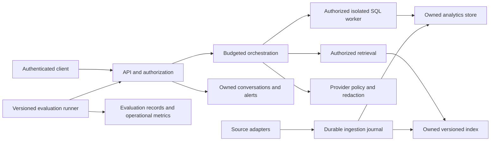

# LogPilot system design and evolution plan

Design baseline: 2026-09-17, implementation commit `4895c91`. Status: local prototype under staged hardening; not approved for shared enterprise use. This document consolidates implemented capabilities and proposed designs. The [roadmap](enterprise_roadmap.md) retains the detailed implementation sequence; [architecture](architecture.md) describes the running code.

Actionable next steps: [implementation task tracker](implementation_tasks.md), with task IDs, dependencies and completion evidence.

## Purpose and design principles

Help an operator investigate logs through natural-language analytics and retrieved operational knowledge, with inspectable evidence and measurable failure behavior. Preserve SQL, retrieval, runbooks, conversation continuity, alerts and MCP while strengthening their boundaries. The project is also a practical enterprise AI engineering curriculum.

Prefer narrow, reversible changes backed by synthetic regression fixtures. Separate deterministic correctness from model quality. Never interpret a judge approval, successful HTTP response or passing unit suite as proof of production readiness. Do not migrate existing data merely to demonstrate a design.

## Implemented capability inventory

| Capability | Current design and recent improvements | Remaining limit |
|---|---|---|
| Natural-language analytics | LangGraph routing, schema-aware SQL generation, bounded SQL repair, structured `sql_rows` alongside legacy text | Live-model accuracy and representative load not established |
| SQL execution | Shared parser policy for model SQL and MCP; approved schema/functions, read-only restricted DuckDB, row/time/memory limits | No tenant row policy, process isolation or response byte bound |
| Retrieval and runbooks | LlamaIndex/Chroma retrieval, log-template knowledge and Markdown topic synthesis | Original versions/whole-document input spans and durable replay now implemented for new documents; precise support spans and replacement activation remain open |
| Evidence | Retrieved artifact IDs/content hashes; unknown citation IDs rejected before judge; evidence displayed safely | Valid ID does not prove claim entailment; mandatory citation coverage and web attribution incomplete |
| Conversation | History serialization repairs and follow-up context; `persist_history:false` supports isolated requests | Shared default session; no user/workspace isolation; isolated multi-turn evaluation uses bounded runner-owned context |
| Bounded orchestration | Separate SQL/context/answer retries; deadlines, provider call budgets, four active query slots per API process; typed query failures | Running synchronous work cannot be forcibly stopped; trace is a message transcript |
| Local-first inference | Configured OpenAI-compatible chat endpoint; Ollama in Compose; external search opt-in | Model availability, hardware sizing and quality must be measured; embeddings have a separate data path |
| Rendering and egress | Escaped plain fields, allowlisted Markdown, vendored renderer/sanitizer, best-effort PII and credential redaction | No comprehensive DLP, raw-data lifecycle or authenticated deployment |
| File ingestion | Immutable-file contract, content fingerprint, SQLite acknowledgement ledger, quarantine and successful-only acknowledgement | Append/tail sources unsupported; pending paths are bounded by disk-backed polling, distributed ownership remains absent |
| Log recovery | Atomic DuckDB rows/event keys/index outbox; deterministic vector upsert; explicit protocol-2 replay skips committed lines | Recover older pending files before newer pattern versions; legacy vectors/Markdown need separate migration; new documents use their own journal |
| Alerts | Polling Sentry detects elevated global error volume and persists alerts with read acknowledgement | Heuristic global baseline; no per-service learned detector or scoped ownership |
| MCP | Restricted SQL tool, natural-language query proxy, recent-log and schema resources | No identity/authorization; transport integration coverage remains open |
| Evaluation | Persisted run roster, exact row/answer contracts, honest denominators, retrieval/citation dimensions, UTC metrics, dataset and request provenance | Scripted fixtures are not live-model quality; durable runner recovery remains open; multi-turn contexts are ephemeral |
| Verification | Isolated backend Docker profile, browser contracts, pinned test dependencies, CI and abrupt transaction crash checks | Full application deployment, clean-install vector smoke and operational qualification remain open |

## Decisions and tradeoffs

1. **Bounded graph over indefinite repair.** Exhausted repair or insufficient evidence ends in abstention or a typed failure. This limits resource consumption, at the cost of rejecting some recoverable requests. See [request budgets](request_budgets.md).
2. **SQL policy plus engine restrictions.** Parsing rejects unsupported expressions before execution; engine settings restrict external access even if policy has a defect. This intentionally narrows accepted SQL. See [SQL policy](sql_execution_policy.md).
3. **Transactional outbox across stores.** DuckDB atomically records log rows, event identities and indexing work. Chroma and SQLite cannot participate in that transaction, so stable IDs and replay bridge failure windows. This is duplicate-safe recovery within the documented file contract, not a distributed exactly-once guarantee. See [ingestion recovery](ingestion_recovery.md).
4. **Deterministic evaluation first.** Exact expected results determine scored outcomes; optional model judges supplement them. Failed requests remain visible in the denominator. See [evaluation contract](evaluation_contract.md).
5. **Additive compatibility.** Keep existing response text and add rows, sources and provenance. Preserve legacy metrics separately rather than presenting them as comparable measurements. Security restrictions can deliberately reject formerly accepted unsafe inputs.
6. **Embedded storage for local learning.** DuckDB and embedded Chroma keep local development accessible. Shared mounts and independent writers create ownership/locking risks; selecting a server database before workload measurements would not itself solve those boundaries.

## Proposed designs and rollout sequence

Everything below is **planned**, not implemented by this documentation update. Each row may require several small PRs. Identity and storage decisions may be designed in parallel, but shared rollout waits for all isolation and operational gates.

| Step | Design and new behavior | Acceptance evidence | Rollback boundary |
|---|---|---|---|
| 1. Complete recovery | Preserve Markdown source/version/span; journal document indexing; bounded ingestion queue, retry/backoff and inspectable quarantine; reconcile legacy vectors | Crash/restart and vector outage tests for logs and documents; no missing/duplicated acknowledged records; clean-install vector smoke | Additive journal versions; stop ingestion and restore compatible worker; retain pending jobs and source bytes |
| 2. Establish quality baseline | Held-out questions with exact rows and source facts; isolated multi-turn conversations; stage event trace; repeated live-model runs with latency/cost/variance | Separate answer, retrieval, citation and availability results; failures retained; versioned dataset/model/template identities | Retain prior dataset/scorer and prompt versions; never rewrite previous run results |
| 3. Introduce identity and scope | Choose identity provider in an ADR; explicit local development identity; user/workspace/conversation ownership; enforce authorization outside model-generated SQL and retrieval | Cross-user/workspace denial tests across query, history, alerts, vectors, metrics and MCP; anonymous access rejected in shared mode | Keep shared mode disabled until complete; do not downgrade populated scoped data to anonymous access |
| 4. Establish storage ownership | Repository interfaces and one explicit owner per mutable store; decide single-owner service versus server database from concurrency needs; remove constructor writes | Concurrent read/write and lock tests; copy/backfill/reconciliation; backup restore; migrate history/alerts before evaluation and analytics | Preserve old data and migration ledger; reconcile post-cutover writes before reverting |
| 5. Package a deployable pilot | Pin runtime artifacts; separate model preparation/demo generation from startup; same-origin UI, explicit CORS, liveness/readiness; request IDs, stage timing, redacted diagnostics; query process and payload limits | Disposable full-stack and MCP tests; model outage, overload and startup failures; no secrets in diagnostics | Versioned configuration/images; rehearsed rollback with schema compatibility check |
| 6. Qualify operations | Agree data scale, concurrency, ingest throughput, latency/error objectives, RTO/RPO; scoped alert baselines; retention and deletion policy | Load/soak, disk pressure, lock contention, backup/restore and incident exercises against agreed numeric objectives | Limit pilot audience/load; stop intake safely and restore using exercised runbook |
| 7. Expand capabilities | Authorized retrieval filters/reranking; versioned runbook evidence; streaming/cancellation and permission-aware caches; genuine independent shadow comparisons; one read-only external source adapter | Each feature improves held-out quality or usability within cost/latency limits and preserves isolation/regression contracts | Feature flags and versioned indexes; disable new path while preserving established query path |

Do not combine storage migration, identity rollout and model changes in one release. Automatic fine-tuning, autonomous remediation, public exposure and unlimited-scale claims are outside this plan. A future connector requires its own source identity, checkpoint, credentials, retention and replay design; Kafka, S3 and CloudWatch are not current source adapters.

## Proposed enterprise boundaries

This is a target architecture, not a description of deployed infrastructure. Tenant filtering belongs in trusted storage/retrieval boundaries and must not depend on prompt compliance. Every cache and background job must carry the same ownership scope as the initiating request.

## Release and migration procedure

For each change: record the design decision and affected contracts; reproduce the failure or establish a feature fixture; implement a small additive change; run relevant isolated tests; review the diff and migration impact; exercise a disposable deployment; then roll out to the appropriate roadmap stage. A green CI result is necessary evidence, not permission to skip deployment gates.

Before persistent schema changes, take and test a restorable backup, document old/new schema compatibility, and reconcile counts and identities on a copy. After cutover, rollback must preserve new writes; restoring an old snapshot alone can lose data. Keep normal operation separate from reset/demo scripts.

## Evidence and learning outcomes

At baseline `4895c91`, recorded checks are 98 isolated backend tests, six browser contracts, abrupt process-crash recovery checks, and a real Chroma/LlamaIndex smoke using synthetic embeddings in an existing image. [CI run 35223139147](https://github.com/Jim-lan/log-pilot/actions/runs/35223139147) passed for that revision. These do not establish production readiness or live-model accuracy. See [verification history](testing_baseline.md).

For each step, retain a short ADR (problem, options, decision, consequences), a reproducible experiment, a failure demonstration and a reflection on the tradeoff. This builds practical experience in distributed consistency, AI evaluation, identity boundaries, migrations and operations rather than only adding model features.

Open decisions: identity provider and workspace model; storage owner topology; deployment target; data classification/retention; quantitative quality, capacity and recovery objectives. Resolve them at the relevant stage using measured requirements; no unchosen vendor or numeric SLO is implied here.

Implementation checkpoint (2026-09-24): R01–R08 tooling and safeguards now cover clean vector CI, document identity/journal/replay, process-crash boundaries, bounded intake, bounded retry, recovery ordering and non-destructive legacy reconciliation planning. R09 adds activity-based retention planning while keeping deletion disabled. These changes do not reconcile actual legacy application data or complete identity, storage-ownership and pilot qualification gates. See the [task tracker](implementation_tasks.md) for verification status.
