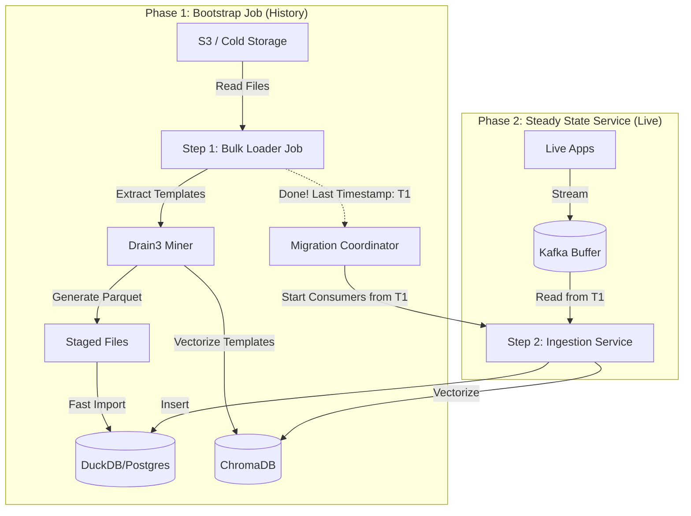

# 🛠️ LogPilot V2: Technical Reference

This document serves as the comprehensive technical guide for developers working on LogPilot. It consolidates the system architecture, component details, script catalog, and functional checklists.

---

## 1. Microservices Architecture

### 1.1 Process Flow
The system operates in two distinct phases:
1.  **Bootstrap (History)**: Batch processing of historical logs.
2.  **Steady State (Live)**: Real-time stream processing.

### 1.2 Component Breakdown

#### A. Data Plane (Ingestion)
| Service | Type | Responsibility |
|---------|------|----------------|
| **Bulk Loader** | Batch Job | Reads historical files, mines templates, loads DuckDB. |
| **Ingestion Worker** | Service | Consumes Kafka stream, masks PII, inserts into DB/Vector Store. |
| **Schema Registry** | Service | Stores regex rules discovered by the Agent. |

#### B. Control Plane (Intelligence)
| Service | Tech | Responsibility |
|---------|------|----------------|
| **Pilot Orchestrator** | LangGraph | Central brain. Routes queries, generates SQL, retrieves knowledge. |
| **Knowledge Base** | LlamaIndex | Manages ChromaDB for semantic search (RAG). |
| **Schema Discovery** | LLM | Learns new log formats and generates regex rules. |
| **Evaluator** | Scikit-Learn | Benchmarks agent performance against golden datasets. |
| **API Gateway** | FastAPI | REST interface (`POST /query`) for external clients. |

---

## 2. Script Catalog & Directory Structure

### 📂 Services
| Path | Key Script | Function |
|------|------------|----------|
| `services/pilot-orchestrator/` | `src/graph.py` | Defines the LangGraph state machine. |
| `services/knowledge_base/` | `src/store.py` | Manages ChromaDB vector index. |
| `services/api_gateway/` | `src/main.py` | FastAPI entry point. |
| `services/schema_discovery/` | `src/generator.py` | LLM-based regex generation. |
| `services/evaluator/` | `src/runner.py` | Runs evaluation benchmarks. |
| `services/ingestion-worker/` | `src/main.py` | Real-time ingestion loop. |

### 📦 Shared Libraries (`shared/`)
| File | Class | Purpose |
|------|-------|---------|
| `llm/client.py` | `LLMClient` | Unified interface for OpenAI/Gemini/Local LLMs. |
| `db/duckdb_client.py` | `DuckDBConnector` | Handles DuckDB connections and batch loading. |
| `utils/pii_masker.py` | `PIIMasker` | Redacts Email, IP, SSN using regex. |
| `utils/log_parser.py` | `LogParser` | Robust regex-based log parsing. |
| `log_schema.py` | `LogEvent` | Pydantic model for the Golden Standard Schema. |

### 📜 Utility Scripts (`scripts/`)
| Script | Usage | Description |
|--------|-------|-------------|
| `reset_demo.py` | `python3 scripts/reset_demo.py` | **Reset**: Cleans DBs and generates fresh mock data. |
| `compare_models.py` | `python3 scripts/compare_models.py` | **Benchmark**: Compares Local vs. Cloud LLM performance. |
| `e2e_test.sh` | `./scripts/e2e_test.sh` | **Test**: Runs full end-to-end validation. |

---

## 3. Functional Review Checklist

### 📥 Ingestion Layer
- [x] **PII Masking**: Redacts Emails, IPs, Credit Cards.
- [x] **Template Mining**: Extracts constant templates via Drain3.
- [x] **Log Parsing**: Structured extraction of Timestamp, Severity, Service.

### 🧠 Knowledge Base
- [x] **Ingestion**: Converts Logs -> LlamaIndex Documents.
- [x] **Retrieval**: Semantic search via ChromaDB.
- [x] **Optimization**: Embeds raw log context for "Why" questions.

### 🚁 Pilot Orchestrator
- [x] **Intent Classification**: Routes to SQL (Data) or RAG (Knowledge).
- [x] **SQL Generation**: Text-to-SQL for DuckDB.
- [x] **RAG Synthesis**: Combines retrieved context into natural answers.

### 📊 Evaluator
- [x] **Metrics**: Measures Regex Match, SQL Accuracy, RAG Relevance.
- [x] **Datasets**: Golden datasets for benchmarking.

### 📚 System Catalog & Advanced
- [x] **Unified Data Layer**: Maps Services -> Departments (Many-to-Many).
- [x] **Local LLM**: Supports `provider="local"` (M4 Chip).
