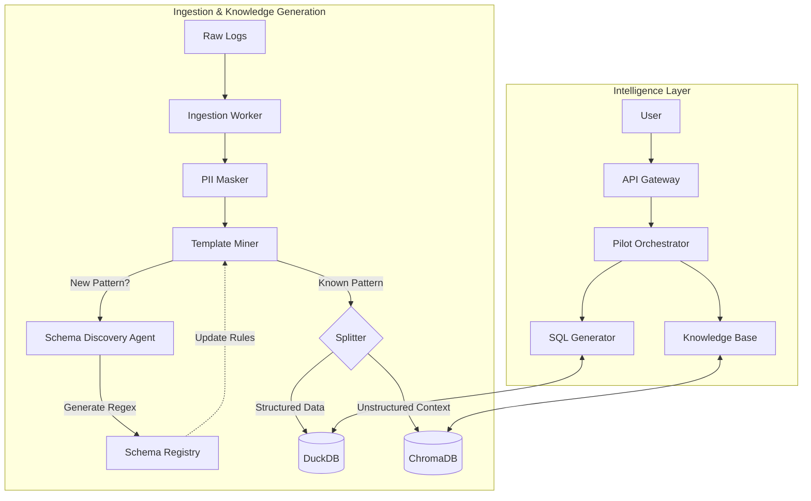

# 🚀 LogPilot V2: Final Project Walkthrough

LogPilot V2 is an intelligent, agentic log management system designed to turn massive volumes of raw logs into actionable business intelligence.

## 🌟 Key Features

### 1. Smart Ingestion & Standardization
- **PII Masking**: Automatically redacts emails, IPs, and credit cards *before* storage.
- **Template Mining**: Uses `Drain3` to cluster millions of log lines into a few unique templates.
- **Unified Data Layer**: Stores structured logs in **DuckDB** and unstructured context in **ChromaDB**.

### 2. Schema Discovery Agent
- **Self-Healing**: Automatically detects new log formats.
- **Generative Regex**: Uses LLMs to generate Python regex patterns with named groups.
- **Validation Loop**: rigoriously tests generated regex against real samples before deploying.

### 3. Business Intelligence (System Catalog)
- **Context Awareness**: Maps technical service names (`auth-service`) to business owners (`Security`, `Finance`).
- **Many-to-Many Support**: Handles complex ownership structures for accurate impact analysis.
- **SQL Joins**: The Agent automatically joins logs with the catalog to answer "Which department is most affected?".

### 4. The "Brain" (Pilot Orchestrator)
- **LangGraph Architecture**: A cyclic state machine that Plans, Executes, and Verifies.
- **Tools**:
    - **SQL Tool**: For quantitative questions ("Count errors").
    - **RAG Tool**: For qualitative questions ("Why is it failing?").
- **Local LLM Support**: Optimized for Apple Silicon (M4), allowing you to switch between Cloud (OpenAI/Gemini) and Local models.

## 🏗️ Architecture Overview

The following diagram illustrates how raw logs are transformed into both **Structured Data** (DuckDB) and **Knowledge** (ChromaDB).



### Key Data Flows & Storage Strategy

1.  **Schema Discovery Loop**:
    *   **Process**: When a **New Pattern** is found, the Agent learns the regex and saves it to the **Schema Registry**.
    *   **Feedback**: The Template Miner immediately uses this new rule to parse future logs, ensuring the system gets smarter over time.

2.  **Structured Analytics (DuckDB)**:
    *   **Content**: Stores extracted fields (`Timestamp`, `Service`, `Severity`) and the System Catalog.
    *   **Purpose**: Answering **Quantitative** questions.
    *   **Example**: "Which department has the most errors?" (Joins `logs` with `system_catalog`).

3.  **Knowledge Base Generation (ChromaDB)**:
    *   **Content**: Stores the **Raw Log Message** and **Error Context** as vector embeddings.
    *   **Purpose**: Answering **Qualitative** (Semantic) questions.
    *   **Example**: "Why is the payment system failing?" (Retrieves logs semantically related to "payment failure", even if keywords don't match exactly).

### 🔗 Combined Workflow Example
**User Query**: *"Who owns the failing service, and how do I fix it?"*

1.  **Step 1: Identify the Service (DuckDB)**
    *   The Agent queries DuckDB: `SELECT system_name, owner_email FROM system_catalog JOIN logs ... ORDER BY error_count DESC LIMIT 1`.
    *   *Result*: "Auth Service (Owner: sec-ops@example.com)".

2.  **Step 2: Retrieve Context (ChromaDB)**
    *   The Agent searches the Knowledge Base for: *"Auth Service common failures and fixes"*.
    *   *Result*: Retrieved Runbook: "If Auth Service fails with 503, restart the token-generator pod."

3.  **Step 3: Synthesize Answer**
    *   *Final Output*: "The **Auth Service** is experiencing the most errors. It is owned by **sec-ops@example.com**. The recommended fix is to **restart the token-generator pod**."

## 🧪 Verification & Benchmarks

We have implemented a robust evaluation suite to ensure reliability.

### 1. Local vs. Cloud Benchmark
Run `python3 scripts/compare_models.py` to see how your Local LLM stacks up against the Cloud.

```text
📊 Final Comparison:
   Cloud Score: 0.95
   Local Score: 0.88
   👉 Recommendation: Local is good enough (and cheaper/faster).
```

### 2. Functional Tests
- **Agent Routing**: Verified in `services/pilot_orchestrator/tests/test_agent.py`.
- **Schema Discovery**: Verified in `services/schema_discovery/tests/`.

## 🚀 How to Run

1. **Install Dependencies**:
   ```bash
   pip install -r requirements.txt
   ```

2. **Run the API**:
   ```bash
   python3 services/api_gateway/src/main.py
   ```

3. **Run the Benchmark**:
   ```bash
   python3 scripts/compare_models.py
   ```

## 📂 Project Structure
- `services/`: Microservices (Ingestion, Pilot, Knowledge Base).
- `shared/`: Common libraries (LLM Client, DB Connectors).
- `docs/`: Comprehensive documentation (Architecture, Business Overview).
- `data/`: Mock data and System Catalog.
